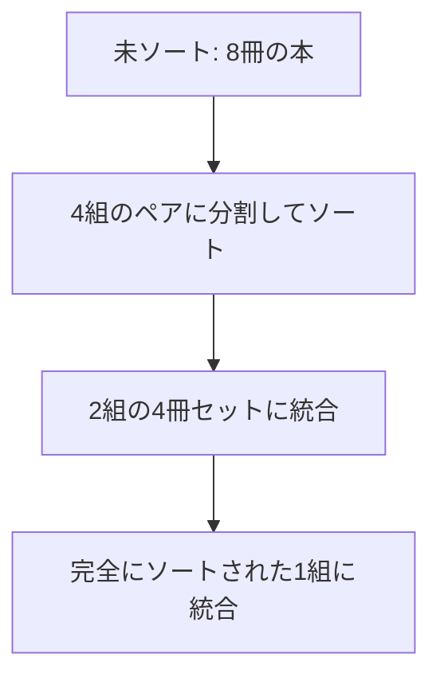

import Callout from '@/components/content/Callout.astro'
import KeyConcept from '@/components/content/KeyConcept.astro'
import Quiz from '@/components/content/Quiz.astro'
import MermaidDiagram from '@/components/content/MermaidDiagram.astro'

## 秩序の代償

コンピューターがこなす仕事の核心にソートがある．1890年のアメリカ国勢調査で，ハーマン・ホレリスがパンチカードで情報をソートする機械を発明した．その会社はやがてIBMとなり，ソートはコンピューティングの歴史を駆動し続けてきた．メールの受信ボックス，検索エンジン，SNSのタイムライン――現代の情報体験は，ほぼすべてがソートされたリストの上位を切り取ったものである．

しかしソートには，直感に反する性質がある．規模が大きくなると，一つあたりのコストが下がるのではなく上がるのだ．50冊の本が入った棚を二つ整理するほうが，100冊の棚を一つ整理するよりも楽である．整理すべき対象が増えるほど，一冊あたりの行き先候補も増えるからだ．

<KeyConcept title="規模の不経済">
ソートにおいて規模は負担である．対象が二倍になると，一つあたりの作業量も増えるため，全体のコストは二倍以上に膨らむ．これはソート理論における最も根本的な洞察であり，整理の苦しみが量に応じて加速度的に増す理由を説明する．
</KeyConcept>

## ビッグO記法と計算量

コンピューター科学者は，アルゴリズムの効率を「ビッグO記法」で評価する．これは問題のサイズと実行時間の関係を大まかに分類する枠組みだ．

夕食会を例にしよう．家の掃除は客が何人でも同じ時間がかかる（定数時間 O(1)）．ローストビーフを配る時間は人数に比例する（線形時間 O(n)）．全員が互いにハグする回数は人数の二乗に比例する（二乗時間 O(n²)）．さらに厳しい指数時間 O(2ⁿ) や階乗時間 O(n!) も存在し，問題が大きくなると手に負えなくなる．

<Callout type="note" title="ビッグO記法のポイント">
ビッグO記法は意図的に細部を切り捨てる．実際の秒数ではなく，問題サイズが大きくなったときに作業量がどう増えるかという「関係の種類」だけを論じる．定数的な差や低次の項はすべて無視される．
</Callout>

## 二乗時間のアルゴリズム

バブルソートは，隣り合う要素を比べて順序が違えば入れ替えるという操作を繰り返す．直感的だが，最悪の場合は O(n²) の時間がかかる．挿入ソートは，要素を一つずつ正しい位置に差し込んでいく方法で，バブルソートよりいくらか速いが，やはり二乗時間の範疇にとどまる．

2007年にオバマ上院議員がグーグルを訪れた際，「100万個の整数をソートする最適な方法は？」と問われて「バブルソートはだめだと思います」と即答し，エンジニアたちから歓声を浴びた．

## 二乗時間の壁を破る――マージソート

<KeyConcept title="マージソートと分割統治">
ジョン・フォン・ノイマンが1945年に考案したマージソートは，データを半分ずつに分割し，それぞれをソートしてから統合（マージ）する「分割統治」の戦略をとる．その計算量は O(n log n) であり，二乗時間の壁を突破した画期的なアルゴリズムである．100万個の要素をソートする場合，二乗時間なら約1兆回の操作が必要だが，マージソートなら約2000万回ですむ．
</KeyConcept>

マージソートは並列処理にも向いている．友人を呼んで本を均等に分担し，それぞれがソートした山を順に統合していけば，書棚の整理がはるかに速く終わる．

<MermaidDiagram title="マージソートの流れ">

</MermaidDiagram>

## バケットソートと「そもそもソートすべきか」

n個のアイテムをペア比較で完全にソートするには，O(n log n) が理論上の下限である．しかし，完全なソートが不要な場合や，比較以外の方法が使える場合には，さらに速くできる．

<KeyConcept title="バケットソートと検索のトレードオフ">
バケットソートは，アイテムをいくつかのカテゴリ（バケット）に振り分ける方法で，線形時間 O(n) で実行できる．完全な順序は得られないが，実用上は十分な粗いソートが高速に得られる．そして何より重要なのは「ソートは将来の検索を助ける場合のみ価値がある」という原則だ．検索する予定のないものをソートするのは完全な無駄であり，無秩序が最適解となる場合もある．
</KeyConcept>

<Callout type="tip" title="メールの整理は時間の無駄？">
IBMの研究者スティーヴ・ホイッテカーの研究によれば，メールをフォルダに振り分けるよりも検索機能を使うほうが効率的である．検索のコストが低い環境では，ソートの価値も下がる．整理しないことが最適となるケースは，日常に意外なほど多い．
</Callout>

## スポーツとソート

ワールドカップ，オリンピック，プロスポーツリーグは，すべて暗黙のうちにソートアルゴリズムを実行している．総当たり戦は O(n²) の比較数え上げソートであり，ブラケットトーナメントはマージソートに相当する．

ルイス・キャロルことチャールズ・ドジソンは1883年，勝ち残りトーナメントでは優勝者以外の順位が信頼できないことを数学的に指摘した．銀メダリストが本当に二番手である保証はないのだ．

<Callout type="important" title="ノイズと頑健性">
現実の試合にはノイズ（偶然）がつきまとう．マージソートのような高速アルゴリズムは一度のエラーで大きく順位がずれるが，バブルソートのように一度に一ポジションしか動かせないアルゴリズムはノイズに対して頑健である．レギュラーシーズンの総当たり方式（比較数え上げソート）が最も頑健なソートであるという事実は，プレイオフで敗退しても嘆く必要がないことを教えてくれる．
</Callout>

## 戦いではなくレースを

動物社会の支配関係もソートの一種だ．しかし一対一の対決による序列決定は，集団が大きくなると対決の回数が爆発的に増える．

レースは根本的に戦いとは異なる．マラソンでは一度の走行で何万人もの順位が決まる．体の大きさ，収入，年齢のような定量的な尺度があれば，ペア比較なしに秩序が生まれる．「序数」（相対的な順位）から「基数」（絶対的な尺度）への移行が，大規模な人間社会を平和的に成立させている鍵の一つである．

<Quiz questions={[
  {
    question: "マージソートの計算量として正しいものはどれか？",
    options: ["O(n)", "O(n log n)", "O(n²)", "O(n!)"],
    answer: 1,
    explanation: "マージソートは分割統治の戦略により，O(n log n)（線形対数時間）で動作する．これはペア比較によるソートの理論的な下限でもある．"
  },
  {
    question: "ソートと検索のトレードオフについて，コンピューター科学が教える原則はどれか？",
    options: ["常にソートしてから検索すべきである", "ソートは将来の検索を助ける場合のみ価値がある", "検索よりもソートのほうが常に高速である", "ソートと検索のコストは常に等しい"],
    answer: 1,
    explanation: "ソートは将来の検索の事前対策である．検索する予定のないものをソートするのは無駄であり，検索コストが低い環境ではソートの価値も下がる．"
  },
  {
    question: "ノイズのある比較に対して最も頑健なソートアルゴリズムはどれか？",
    options: ["マージソート", "バブルソート", "比較数え上げソート（総当たり方式）", "バケットソート"],
    answer: 2,
    explanation: "比較数え上げソート（総当たり方式）は，すべてのペアを比較して勝敗数で順位を決めるため，ノイズに対して最も頑健である．スポーツのレギュラーシーズンがこの方式に相当する．"
  }
]} />
