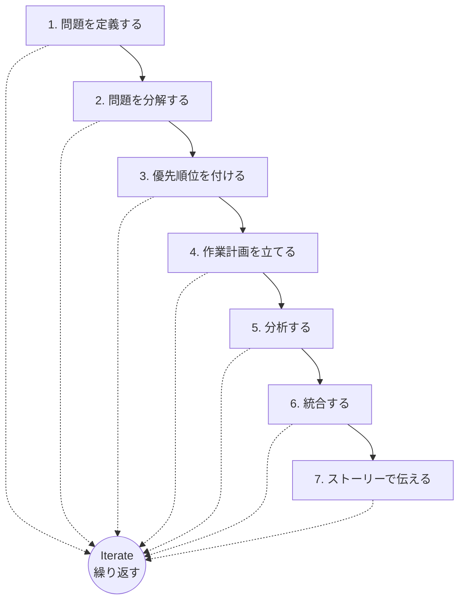

import Callout from '@/components/content/Callout.astro'
import KeyConcept from '@/components/content/KeyConcept.astro'
import Quiz from '@/components/content/Quiz.astro'
import MermaidDiagram from '@/components/content/MermaidDiagram.astro'

## 日本語もわからないのに，キヤノンの工場立地モデルを作った話

著者のチャールズ・コンは，マッキンゼーに入社してまもない頃，日本のキヤノンの新工場立地を決定するプロジェクトに配属された．日本語がまったく話せない状態で，工場の建設コスト，労働市場の状況，物流ネットワークなど複雑な要素を分析し，最適な立地を提案しなければならなかった．

言語の壁は大きかったが，彼はこの経験を通じて重要な教訓を得た．問題解決の本質は，言語や専門知識そのものではなく，問題を構造化し，論理的に分解する能力にあるということだ．マッキンゼーの問題解決アプローチ——すなわち問題を明確に定義し，ロジックツリーで分解し，優先順位をつけて分析する手法——は，どんな複雑な状況でも適用できる普遍的なスキルだった．

<KeyConcept title="問題解決はスキルである">
問題解決能力は生まれつきの才能ではなく，訓練によって習得できるスキルである．マッキンゼーのコンサルタントたちが複雑なビジネス問題を短期間で解決できるのは，天才だからではなく，構造化された問題解決プロセスを徹底的に訓練しているからだ．
</KeyConcept>

この経験が著者のキャリアの原点となり，「完全無欠の問題解決（Bulletproof Problem Solving）」というフレームワークの構築へとつながっていく．

## 上司に突然進捗を聞かれても「現時点での答え」を即答できる

マッキンゼーには「Day 1 Answer（初日の答え）」という重要な概念がある．これは，プロジェクトの初日から「現時点での最善の仮説」を持つことを意味する．

多くの人は分析が完了するまで答えを出すのを避けようとする．しかし優れた問題解決者は，不完全な情報の中でも仮説を構築し，上司やクライアントに「現時点での答え」を即座に提示できる．

<Callout type="tip" title="Day 1 Answerの実践">
Day 1 Answerとは「最終的な答え」ではない．「今わかっていることに基づく最善の仮説」であり，新しい情報が得られるたびに修正・進化させるものだ．エレベーターの中で上司に突然聞かれても，30秒で現時点の考えを説明できる状態を常に保つことが重要である．
</Callout>

この習慣は，分析の方向性を早い段階で検証し，時間とリソースの無駄を防ぐ効果がある．間違った方向に何週間も走り続けるリスクを最小化できるのだ．

## すべての問題解決は「ロジックツリー」から始まる

本書の核心は，著者たちがマッキンゼーで磨き上げた7ステップの問題解決アプローチである．このプロセスは直線的に進むものではなく，各ステップ間を繰り返し行き来（Iterate）しながら，解決策の精度を高めていく．

<MermaidDiagram title="完全無欠の問題解決：7ステップアプローチ">

</MermaidDiagram>

<KeyConcept title="7ステップの問題解決プロセス">
1. 問題を定義する -- 解くべき問題を具体的かつ測定可能な形で明文化する．
2. 問題を分解する -- ロジックツリーを使って問題を構成要素に分解する．
3. 優先順位を付ける -- 最もインパクトの大きい要素に注力する．
4. 作業計画を立てる -- 誰が何をいつまでにやるかを計画する．
5. 分析する -- データを収集し，仮説を検証する．
6. 統合する -- 分析結果を組み合わせて結論を導く．
7. ストーリーで伝える -- 意思決定者が行動できる形で伝える．

各ステップ間で繰り返し（Iterate）を行い，理解の深まりに応じてプロセスを修正する．
</KeyConcept>

このプロセスの中心にあるのが「ロジックツリー」だ．ロジックツリーとは，問題をMECE（Mutually Exclusive, Collectively Exhaustive：モレなくダブりなく）に分解する手法である．すべての問題解決はロジックツリーから始まり，分解された各要素に対して優先順位を付け，集中的に分析を行う．

## 5つのケースで「完全無欠（ブレットプルーフ）の問題解決」ガイド

本書では，7ステップのアプローチを5つの異なる領域のケースに適用することで，このメソッドがビジネスだけでなく，個人の意思決定や公共政策にまで幅広く活用できることを示している．

### ケース1　シドニー空港の規模は将来的に十分か？

オーストラリアのシドニー空港は，将来の旅客数増加に対して現在の規模で対応できるのか．この典型的なビジネス問題に対し，7ステップのプロセスを適用する．旅客需要の予測，空港のキャパシティ分析，代替案（新空港建設・既存空港の拡張など）のコスト比較を通じて，データに基づく意思決定の方法を学ぶ．

### ケース2　自宅の屋根にソーラーパネルを設置すべきか？

個人の家計に関する意思決定にも，構造化された問題解決は威力を発揮する．設置コスト，電気料金の節約額，政府の補助金，パネルの寿命，住宅の売却可能性など，複数の変数をロジックツリーで整理し，投資判断を行う方法を示す．

### ケース3　どこに住むべきか？

ライフスタイルの選択は感情的になりやすいが，ここでも構造化アプローチが有効だ．生活費，気候，雇用機会，教育環境，コミュニティなどの要素を明確にし，定量的・定性的な基準で複数の候補地を評価するフレームワークを提示する．

### ケース4　スタートアップ企業は販売価格を上げるべきか？

価格戦略はスタートアップの成否を左右する重要な意思決定だ．価格弾力性，競合状況，顧客セグメント，コスト構造などをロジックツリーで分解し，価格引き上げの影響をシミュレーションする手法を学ぶ．

### ケース5　幼稚園から高校までの学校教育税負担を支援すべきか？

公共政策の問題は利害関係者が多く，複雑さが際立つ．教育税の増額が学力向上につながるのか，費用対効果はどうか，代替的な資金調達手段はないかなど，市民としての意思決定にも7ステップが適用できることを示す．

<Callout type="note" title="5つのケースが示すこと">
これら5つのケースは，問題解決の7ステップアプローチが万能であることを示している．ビジネスの戦略的意思決定だけでなく，個人の生活設計，社会課題の解決にも同じフレームワークが適用できる．重要なのは，問題の種類に関わらず「構造化して考える」という姿勢を持つことだ．
</Callout>

## 第1章のまとめ

本章では，「完全無欠の問題解決」メソッドの全体像を概観した．著者のマッキンゼー時代の経験は，問題解決が訓練によって身につくスキルであることを示している．Day 1 Answerの概念は，常に仮説を持ち続けることの重要性を教えてくれる．

そして本書の核となる7ステップのアプローチ——問題定義，分解，優先順位付け，作業計画，分析，統合，ストーリーテリング——は，すべてロジックツリーを基盤として構築される．5つの多様なケースは，このフレームワークがビジネスに限らず，人生のあらゆる意思決定に適用可能であることを証明する．

次章以降では，7ステップのそれぞれを詳しく掘り下げ，ロジックツリーの作り方から分析手法，そして最終的なストーリーテリングまでを実践的に学んでいく．

<Quiz questions={[
  {
    question: "マッキンゼーの「Day 1 Answer」とは何を指すか？",
    options: ["プロジェクト初日に提出する最終報告書", "不完全な情報に基づく現時点での最善の仮説", "クライアントが最初に提示した問題定義", "分析完了後に導き出される最終的な答え"],
    answer: 1,
    explanation: "Day 1 Answerとは，プロジェクトの初日から持つべき「現時点での最善の仮説」のことです．分析の進行に伴い修正・進化させていくものであり，最終報告書ではありません．"
  },
  {
    question: "7ステップの問題解決アプローチにおいて，中心に位置する概念は何か？",
    options: ["ロジックツリー", "MECE", "Iterate（繰り返す）", "Day 1 Answer"],
    answer: 2,
    explanation: "7ステップの中心にはIterate（繰り返す）があります．各ステップ間を行き来しながら理解を深め，解決策の精度を高めていくプロセスが重要です．"
  },
  {
    question: "本書の5つのケースが示す主要なメッセージはどれか？",
    options: ["問題解決の手法はビジネス問題にのみ適用可能である", "7ステップのアプローチはビジネスだけでなく個人や公共政策にも適用できる", "問題解決にはMBAの学位が必要である", "各問題にはそれぞれ異なる問題解決手法が必要である"],
    answer: 1,
    explanation: "5つのケースは，ビジネス問題，個人の意思決定，ライフスタイル選択，価格戦略，公共政策と多岐にわたり，7ステップのアプローチがあらゆる領域で活用可能であることを示しています．"
  }
]} />
