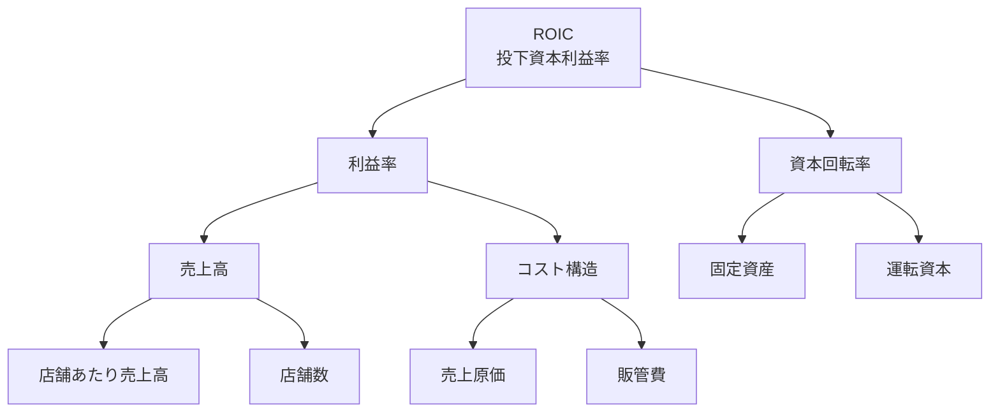
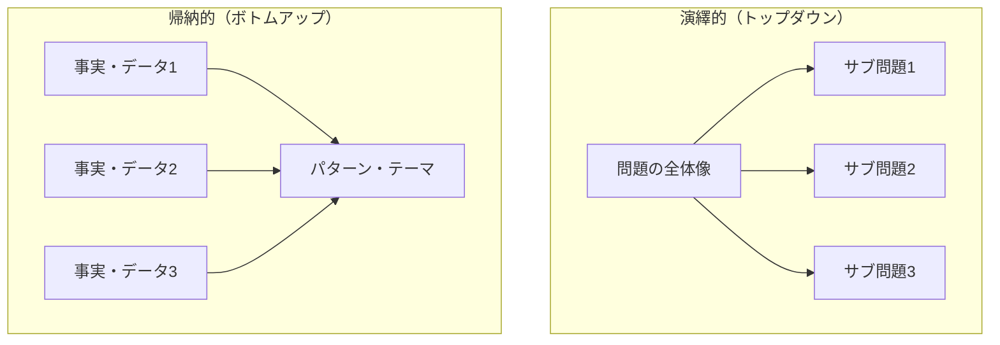

import Callout from '@/components/content/Callout.astro'
import KeyConcept from '@/components/content/KeyConcept.astro'
import Quiz from '@/components/content/Quiz.astro'
import MermaidDiagram from '@/components/content/MermaidDiagram.astro'

## 「ロジックツリー」でエレガントな解決策を見つける

問題解決の第一歩は，問題を適切に定義することだった．次に取り組むべきは，その問題を構成要素に分解し，どこに注力すべきかの優先順位を付けることだ．そのために最も強力なツールが「ロジックツリー」である．

<KeyConcept title="MECE原則：漏れなく・ダブりなく">
ロジックツリーを構築する際の基本原則がMECE（Mutually Exclusive, Collectively Exhaustive）だ．各枝は互いに重複せず（漏れなく），全体として問題の全領域をカバーする（ダブりなく）必要がある．MECEでない分解は，重要な要因を見落としたり，同じ要因を二重にカウントしたりする原因となる．
</KeyConcept>

ロジックツリーの目的は，複雑な問題を管理可能な小さなパーツに分割することだ．優れたロジックツリーは，問題の構造を明らかにし，どの要素が最も大きな影響を持つかを可視化してくれる．著者らはマッキンゼーでの経験から，最も効果的な問題解決者は，いきなり答えに飛びつくのではなく，まずロジックツリーを描いて問題の全体像を把握するという共通点を持っていたと述べている．

## 問題解決の「梃子レバー」を見つけるには

ロジックツリーの真の価値は，単に問題を分解することではなく，「レバレッジポイント」を特定することにある．レバレッジポイントとは，少ない労力で最大の効果を生み出せる箇所のことだ．すべての枝に等しく時間をかけるのではなく，最も影響度が高く，かつ実行可能性のある枝に集中することで，効率的な問題解決が可能になる．

<Callout type="tip" title="レバレッジポイントの見極め方">
各枝について「この要因が解決されたら，全体の問題はどの程度改善されるか」と「この要因に対して，実現可能な施策はあるか」の2つの問いを投げかけよう．両方の答えが「大きい」である枝こそが，最優先で取り組むべきレバレッジポイントだ．
</Callout>

## 最初のツリーで問題を素早く把握する

著者らは，完璧なツリーを最初から描こうとする必要はないと強調する．まずは30分程度で最初のツリーを描き，チームで議論しながら改善していくアプローチが効果的だ．最初のツリーが不完全であっても，それをたたき台として議論を進めることで，問題の構造に対する理解が深まっていく．

## ロジックツリーから仮説を引き出せないときは

場合によっては，最初のロジックツリーから明確な仮説を引き出せないことがある．その際には以下のアプローチが有効だ．ツリーの枝をさらに細かく分解してみること，別の切り口でツリーを再構築してみること，そしてデータや専門家の意見を参考にして新たな視点を取り入れることだ．重要なのは，一つのツリーに固執せず，柔軟に複数のツリーを試すことである．

## 「演繹的ロジックツリー」で競合他社と収益構造を比較する

ロジックツリーには大きく分けて2つのアプローチがある．まず「演繹的ロジックツリー」はトップダウン型の分解だ．既知の構造やフレームワークを使い，問題を上位概念から下位概念へと論理的に分解していく．

<MermaidDiagram title="演繹的ロジックツリー：ROIC分解の例">

</MermaidDiagram>

### ケース：ホームセンター業界の首位争い（ホームデポ vs ヘチンガー）

1990年代のアメリカのホームセンター業界で，ホームデポとヘチンガーという2社が激しい競争を繰り広げていた．両社のビジネスモデルの違いを理解するために，著者らは演繹的ロジックツリーを用いてROIC（投下資本利益率）を分解した．

### ROICの比較でビジネスモデルの違いが浮き彫りになる

ROICをツリーで分解すると，利益率と資本回転率に分かれる．ホームデポは「毎日がお買い得」という低価格戦略で薄利多売を実現し，高い資本回転率で利益を稼ぐモデルだった．一方のヘチンガーは，従来型の高マージン戦略を採用していた．

### 店舗あたり売上高で倍の差をつけられたヘチンガーの失敗

ツリーをさらに掘り下げると，決定的な差が見えてくる．ホームデポの店舗あたり売上高はヘチンガーの約2倍だった．これは，ホームデポが大型の倉庫型店舗で幅広い品揃えと低価格を実現したことで，集客力に圧倒的な差が生まれたためだ．ヘチンガーはこの構造的な弱みを克服できず，最終的に倒産に至った．ロジックツリーによる分解がなければ，この本質的な差異を見落としていたかもしれない．

## ケース：サンフランシスコの看護師不足（帰納的アプローチの例）

サンフランシスコの病院では深刻な看護師不足に直面していた．この問題に対して，まず現場の看護師や病院管理者へのインタビュー，離職率データの分析，他地域との比較調査など，ボトムアップで情報を収集した．すると，給与水準の問題だけでなく，住居費の高騰，過酷な労働シフト，キャリアパスの不明確さなど，複数の要因が複合的に絡み合っていることが見えてきた．

## 「帰納的ロジックツリー」で一般原則を導く

<KeyConcept title="帰納的ロジックツリー：ボトムアップ分解">
帰納的ロジックツリーは，個別の事実やデータから出発して，共通するパターンやテーマを見出し，上位の一般原則へとまとめ上げていくアプローチだ．既存のフレームワークが存在しない新しい問題や，複雑に入り組んだ社会問題に対して特に有効である．
</KeyConcept>

演繹的アプローチと帰納的アプローチは，状況に応じて使い分けるべきだ．問題の構造がある程度わかっている場合は演繹的アプローチが効率的だが，未知の領域や複雑な問題には帰納的アプローチが適している．実際には両方を組み合わせて使うことも多い．

<MermaidDiagram title="演繹的アプローチと帰納的アプローチの比較">

</MermaidDiagram>

## ケース：現代にはそぐわない歴史的偉人の価値観

著者らは，帰納的アプローチの例として，歴史的偉人の価値観を現代の文脈で評価するケースを取り上げている．個別の事例（特定の偉人の言動）を収集し，それらをグループ化してパターンを見出すことで，「時代背景と価値観の変遷」という一般原則を導き出すことができる．このように帰納的ツリーは，複雑で多面的な問題に対して，構造を発見するための有力な手法である．

## 「優先順位付け」によって少ない努力で速く問題解決できる

ロジックツリーで問題を分解したら，次に重要なのが優先順位付けだ．すべての枝に同じリソースを割くのは非効率的であり，問題解決のスピードと質の両方を大きく損なう．著者らは「少ない努力で大きな効果を得る」ことを問題解決の鉄則として掲げている．

<Callout type="note" title="80/20の法則を意識する">
多くの場合，問題の80%は全体の20%の要因によって引き起こされている．ロジックツリーの枝のうち，最も影響力の大きい上位2～3本に集中することで，効率的に問題を解決できる．すべての枝を完璧に分析しようとするのは，時間と労力の浪費になりかねない．
</Callout>

## 「分割フレーム」で潜在的な解決策を洗い出す

<KeyConcept title="分割フレーム：解決策の発想を広げるツール">
分割フレームとは，問題を対立する2つの軸で捉え直すことで，見落としていた解決策のオプションを浮き彫りにする手法だ．1つの問題に対して複数の分割フレームを適用することで，思考の偏りを防ぎ，創造的な解決策を生み出すことができる．
</KeyConcept>

## 解決策を素早く見出す8つの分割フレーム

著者らは，さまざまな問題に適用可能な8つの分割フレームを提案している．

1. **価格/数量** -- 問題を価格の側面と数量の側面に分けて考える
2. **プリンシパル/エージェント** -- 意思決定者（プリンシパル）と代理人（エージェント）のインセンティブのズレに着目する
3. **資産/オプション** -- 既存の資産を活用するか，新たなオプションを創出するかで分ける
4. **協力/競争** -- 関係者間の協力関係と競争関係を区別して考える
5. **規制/インセンティブ** -- ルールで強制するか，動機づけで誘導するかを分ける
6. **平等/自由** -- 公平性の追求と自由度の確保のバランスを考える
7. **緩和/適応** -- 問題の原因を取り除くか，結果に適応するかで分ける
8. **需要/供給** -- 需要サイドの施策と供給サイドの施策を分けて考える

## ケース：気候変動の緩和と費用曲線

気候変動問題は，分割フレームの効果を示す好例だ．「緩和/適応」フレームを適用すると，CO2排出を削減する「緩和策」と，気候変動の影響に備える「適応策」の両面から解決策を整理できる．著者らは，各緩和策のコストと効果を費用曲線として可視化し，コスト効率の高い施策から順に実施すべきだと提案している．例えば，建物の断熱改善は投資を上回るコスト削減効果が見込める一方，CCS（炭素回収貯留）はコストが高いが長期的には必要な施策となる．

## 個人の問題解決でも使える3つの分割フレーム

分割フレームは企業や社会の問題だけでなく，個人のキャリアや人生の意思決定にも応用できる．著者らは個人向けに以下の3つの分割フレームを推奨している．

- **仕事/遊び** -- キャリアの選択を，仕事としての充実感と遊びとしての楽しさの両面から評価する
- **短期的/長期的** -- 目先の利益と将来の価値のバランスを考える
- **経済的/非経済的** -- 金銭的なリターンだけでなく，やりがい，人間関係，健康などの非経済的価値も含めて意思決定する

<Callout type="tip" title="分割フレームを個人の意思決定に活かす">
転職やキャリアチェンジを検討する際，「短期的/長期的」フレームを使えば，目先の年収だけでなく5年後・10年後のスキル蓄積や市場価値も含めた総合的な判断ができる．複数のフレームを組み合わせることで，より多角的な意思決定が可能になる．
</Callout>

## 「チームの力」で問題解決を創造的にする

問題の分解と優先順位付けは，一人で行うよりもチームで取り組む方が効果的だ．多様なバックグラウンドを持つメンバーが集まることで，異なる切り口のロジックツリーや分割フレームが生まれ，一人では思いつかなかった解決策が見えてくる．

著者らは，チームでのブレインストーミングにおいて以下の点を重視している．まず全員が独自のツリーを描いてから持ち寄ること，批判を後回しにしてまずは量を出すこと，そして異なる視点を積極的に歓迎することだ．ロジックツリーと分割フレームという構造化されたツールを共通言語として使うことで，チームの議論は生産的で創造的なものになる．

<Quiz questions={[
  {
    question: "MECE原則について正しい説明はどれか？",
    options: ["各枝が互いに重複してもよいが，全体として問題をカバーする必要がある", "各枝が互いに重複せず，全体として問題の全領域をカバーする必要がある", "各枝は独立しているが，全体のカバー率は問わない", "各枝は必ず3つ以上に分解しなければならない"],
    answer: 1,
    explanation: "MECE（Mutually Exclusive, Collectively Exhaustive）とは，各枝が互いに重複せず（漏れなく），全体として問題の全領域をカバーする（ダブりなく）必要があるという原則です．"
  },
  {
    question: "演繹的ロジックツリーと帰納的ロジックツリーの違いとして正しいのはどれか？",
    options: ["演繹的はデータから出発し，帰納的は既存フレームワークから出発する", "演繹的はトップダウンで既知の構造から分解し，帰納的はボトムアップで事実からパターンを見出す", "演繹的は個人向け，帰納的は組織向けのツールである", "演繹的は定性分析，帰納的は定量分析に限定される"],
    answer: 1,
    explanation: "演繹的ロジックツリーは既知の構造やフレームワークを使って上位から下位へトップダウンに分解します．帰納的ロジックツリーは個別の事実やデータから出発し，共通パターンを見出してボトムアップに一般原則を導きます．"
  },
  {
    question: "著者らが提案する8つの分割フレームに含まれないものはどれか？",
    options: ["価格/数量", "規制/インセンティブ", "リスク/リターン", "緩和/適応"],
    answer: 2,
    explanation: "8つの分割フレームは，価格/数量，プリンシパル/エージェント，資産/オプション，協力/競争，規制/インセンティブ，平等/自由，緩和/適応，需要/供給です．「リスク/リターン」は含まれていません．"
  }
]} />
