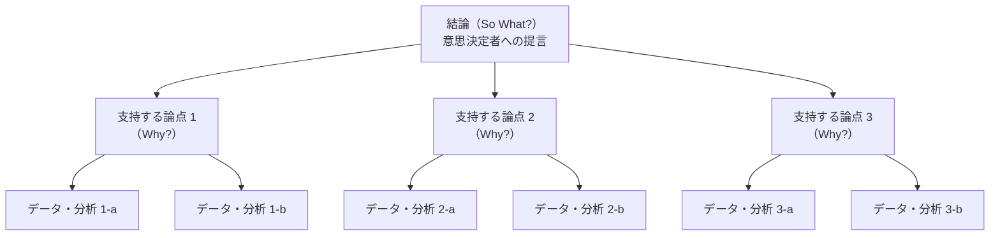

import Callout from '@/components/content/Callout.astro'
import KeyConcept from '@/components/content/KeyConcept.astro'
import Quiz from '@/components/content/Quiz.astro'
import MermaidDiagram from '@/components/content/MermaidDiagram.astro'

## もう，プレゼンにびくびくしなくていい

どれほど優れた分析を行っても，その結果が意思決定者に正しく伝わらなければ意味がない．多くの人がプレゼンテーションに不安を感じるのは，「何を，どの順番で話せばいいかわからない」からだ．しかし，問題解決の7ステップを忠実にたどってきた人には，実はすでに伝えるべき材料がすべて揃っている．

ストーリーテリングの本質は，聞き手の立場に立って「So What?（だから何なのか？）」に答えることだ．分析のプロセスをそのまま時系列で報告するのではなく，聞き手が最も知りたい結論から逆算して構成する．これが，プレゼンテーションの不安を解消する最も確実な方法である．

<KeyConcept title="ストーリーテリングの本質">
優れたプレゼンテーションとは，分析の過程を時系列で説明することではない．聞き手が行動を起こせるように，結論から逆算して構成されたストーリーである．問題解決のプロセスを通じてすでに蓄積された発見を，聞き手の視点で再構成する技術がストーリーテリングだ．
</KeyConcept>

マッキンゼーをはじめとするトップコンサルティングファームでは，新人コンサルタントでもクライアントの経営陣に対して説得力のあるプレゼンテーションを行う．それは彼らが天性のプレゼンターだからではなく，構造化された伝え方のフレームワークを習得しているからだ．

## 発見は「ツリー」上にまとめると伝わる

問題解決のステップ2で作成したロジックツリーは，分析の設計図であった．ステップ7では，このロジックツリーを「逆にたどる」ことで，発見を統合する．

分析段階では，ロジックツリーの枝葉から根に向かってデータを集め，仮説を検証してきた．伝える段階では，その逆だ．根（結論）から枝葉（根拠）へと展開する．聞き手はまず全体像を理解し，次にそれを裏付ける詳細を確認する．

<Callout type="tip" title="ロジックツリーを逆にたどる">
分析時のロジックツリーは「分解」のツールだったが，コミュニケーション時には「統合」のツールとなる．各枝の分析結果を要約し，上位の枝に向かって「だから何が言えるのか（So What?）」を積み上げていく．最終的にツリーの頂点に到達したとき，それが全体の結論になる．
</Callout>

この「逆たどり」を行うことで，膨大な分析結果が論理的に整理される．聞き手は「結論→理由→根拠」という自然な流れで情報を受け取れるため，理解しやすく，納得しやすい．

## 「1日の答え」を「ピラミッド構造」に移行させる

分析を通じて得られた発見を効果的に伝えるために，バーバラ・ミントが体系化した「ピラミッド原則」を活用する．ミントは元マッキンゼーのコンサルタントであり，その著書『考える技術・書く技術』は，ビジネスコミュニケーションの古典として世界中で読まれている．

<MermaidDiagram title="ピラミッド構造：結論から根拠へ">

</MermaidDiagram>

<KeyConcept title="ピラミッド原則の3層構造">
ピラミッド構造は3つの層で構成される．第1層（頂点）は結論であり，「So What?（だから何なのか？）」に一文で答える．第2層は結論を支持する論点であり，「Why?（なぜそう言えるのか？）」に答える3つ程度の理由を示す．第3層は各論点を裏付けるデータや分析結果である．この構造に従えば，どんな複雑な分析結果も明快に伝えることができる．
</KeyConcept>

ピラミッドの頂点には，「結論」を置く．これは問題定義に対する直接的な回答であり，聞き手が最も知りたいことだ．「新工場はA地点に建設すべきである」「マーケティング予算を20%再配分すべきである」のように，具体的で行動可能な提言を一文で表現する．

第2層には，結論を支持する3つ程度の論点を置く．なぜA地点なのか？ コストが最も低いから，労働力が確保しやすいから，物流ネットワークに近いから——というように，結論の根拠を論理的に示す．

第3層には，各論点を裏付ける具体的なデータや分析結果を配置する．コスト比較表，労働市場の統計データ，物流シミュレーションの結果などがここに入る．

## 説得力のあるストーリーは「ピラミッド構造」から作る

ピラミッド構造は，論理的な「骨格」である．これを聞き手の心に響くストーリーに変換するために，「状況→複雑化→解決策」の3幕構成を用いる．

### 状況（Situation）

まず，聞き手が同意できる客観的な事実を提示する．「当社は過去3年間，国内市場で安定的に成長してきた」「現在の生産能力は需要の90%をカバーしている」など，誰もが認める現状を簡潔に述べる．

### 複雑化（Complication）

次に，現状を脅かす変化や課題を示す．「しかし，競合他社の東南アジア進出により，来年度のシェアは10%低下する見込みだ」「このままでは2年以内に生産能力が需要を下回る」など，なぜ今行動しなければならないのかという緊張感を生み出す．

### 解決策（Resolution）

最後に，ピラミッドの頂点に置いた結論を提示する．状況と複雑化を聞いた後であれば，聞き手は自然と「では，どうすればいいのか？」という問いを持っている．そのタイミングで結論を示すことで，最大の説得力が生まれる．

<Callout type="note" title="SCRフレームワークの実践">
状況（Situation）→ 複雑化（Complication）→ 解決策（Resolution）の流れは，ハリウッド映画の脚本構造とも共通する．映画が「設定→対立→解決」で観客を引き込むように，ビジネスプレゼンテーションも「現状→課題→提言」で聞き手の関心と行動を引き出す．
</Callout>

## 聞き手に都合の悪い結論を伝えるには

分析の結論が聞き手にとって「聞きたくないもの」であるケースは少なくない．「撤退すべきだ」「投資を中止すべきだ」「組織を再編すべきだ」といった結論は，聞き手の既存の計画や感情と衝突する．

このような場合，ピラミッド構造の使い方を工夫する必要がある．結論を冒頭で突きつけるのではなく，まず聞き手が同意できるデータや事実から積み上げていく「ボトムアップ型」のプレゼンテーションが有効だ．

<KeyConcept title="抵抗を予測した伝え方">
聞き手に都合の悪い結論を伝える場合，3つの原則がある．第1に，聞き手の反論を事前に想定し，それに対するデータを用意する．第2に，結論に至るプロセスに聞き手を巻き込み，「一緒に発見した」感覚を作る．第3に，結論がもたらすメリットだけでなく，行動しないことのリスクも明示する．
</KeyConcept>

まず聞き手が認めざるを得ない事実を提示し，そこから論理的に結論を導く．聞き手は自分自身の思考プロセスの中で結論にたどり着くため，外から押し付けられたという抵抗感が軽減される．

また，聞き手がどのような反論をするかを事前にシミュレーションし，それに対する回答を準備しておくことも不可欠だ．「コストが高すぎるのでは？」「リスクが大きすぎるのでは？」「別の選択肢はないのか？」といった典型的な反論に対して，データに基づく明確な回答を用意しておけば，プレゼンテーションの説得力は格段に高まる．

最も重要なのは，「行動しない場合のコスト」を具体的に示すことだ．人は現状維持バイアスによって変化を避けようとする．「変えるリスク」だけでなく「変えないリスク」を数字で示すことで，聞き手は行動の必要性を実感する．

<Callout type="tip" title="プレゼンテーションの最終チェック">
プレゼンテーションを完成させたら，次の3つの質問でチェックしよう．（1）聞き手が最初の30秒で「この話は自分に関係がある」と感じるか？（2）すべてのスライドが「So What?」テストに合格するか？（3）聞き手が会議室を出た後，具体的に何をすべきかわかるか？
</Callout>

<Quiz questions={[
  {
    question: "バーバラ・ミントのピラミッド構造において，頂点に置くべきものは何か？",
    options: ["分析に使用したデータの一覧", "結論（So What? に対する回答）", "問題の背景と経緯の説明", "分析手法の詳細な解説"],
    answer: 1,
    explanation: "ピラミッド構造の頂点には結論を置く．「So What?（だから何なのか？）」に対する直接的な回答であり，聞き手が最も知りたい情報を最初に提示する．データや背景は結論を支える下位の層に配置する．"
  },
  {
    question: "聞き手に都合の悪い結論を伝える際，最も効果的なアプローチはどれか？",
    options: ["結論を最初に述べ，強い口調で押し切る", "結論を曖昧にして聞き手の反発を避ける", "聞き手が同意できるデータから積み上げ，結論に導く", "結論を伝えず，データだけを提示して聞き手に判断を委ねる"],
    answer: 2,
    explanation: "聞き手に都合の悪い結論を伝える場合，まず聞き手が認めざるを得ない事実やデータを提示し，そこから論理的に結論を導く「ボトムアップ型」のアプローチが効果的だ．聞き手自身が結論にたどり着く感覚を作ることで，抵抗感を軽減できる．"
  },
  {
    question: "SCRフレームワークにおける「複雑化（Complication）」の役割として正しいものはどれか？",
    options: ["分析結果の詳細なデータを提示する", "現状を脅かす変化や課題を示し，行動の緊急性を生み出す", "聞き手が同意できる客観的な事実を提示する", "具体的な解決策とアクションプランを提案する"],
    answer: 1,
    explanation: "複雑化（Complication）は，状況（Situation）で示した安定的な現状を脅かす変化や課題を提示するパートだ．「なぜ今行動しなければならないのか」という緊張感を生み出し，聞き手に解決策を求める心理的な準備をさせる役割を果たす．"
  },
]} />
