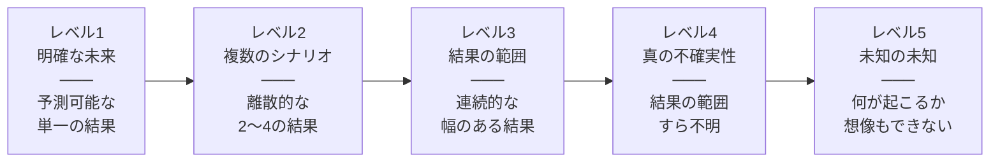

import Callout from '@/components/content/Callout.astro'
import KeyConcept from '@/components/content/KeyConcept.astro'
import Quiz from '@/components/content/Quiz.astro'
import MermaidDiagram from '@/components/content/MermaidDiagram.astro'

## 期間が長く，複雑で，失敗が許されないケースの対処法

これまで学んできた7ステップの問題解決プロセスは，多くのビジネス上の問題に対して有効だ．しかし現実世界では，予測が極めて困難な状況に直面することがある．キャリアの選択，退職後の資金計画，大規模な投資判断，新規事業の立ち上げ——これらはいずれも，長い時間軸にまたがり，複雑な変数が絡み合い，失敗のコストが大きい問題だ．

こうした「不確実性の高い問題」に対処するには，7ステップの基本プロセスに加えて，不確実性そのものを分析し，対処する専用のツールキットが必要になる．本章では，不確実性の度合いを見極める方法と，それぞれのレベルに応じた6つの対処行動を学ぶ．

<KeyConcept title="不確実性下の問題解決">
不確実性が高い問題では，「正しい答えを見つける」こと自体が不可能な場合がある．重要なのは，不確実性のレベルを正しく見極め，そのレベルに適した意思決定の方法を選択することだ．確実な答えを求めて分析に時間をかけすぎるのも，不確実性を無視して楽観的に突き進むのも，どちらも危険な判断である．
</KeyConcept>

## 不確実性には5つのレベルがある

マッキンゼーの戦略グループが体系化した「不確実性の5つのレベル」は，直面している問題の不確実性の度合いを見極めるための有効なフレームワークだ．

<MermaidDiagram title="不確実性の5つのレベル">

</MermaidDiagram>

レベル1は「明確な未来」だ．十分な分析によって結果を高い精度で予測できる．たとえば，既存市場での小規模な価格変更の影響などがこれにあたる．従来の7ステップアプローチがそのまま有効だ．

レベル2は「複数のシナリオ」だ．結果が2つから4つの離散的なシナリオに収束する場合だ．規制の変更（施行されるか，されないか），競合他社の参入（参入するか，しないか）など，二者択一的な変数が支配的な状況がこれにあたる．

レベル3は「結果の範囲」だ．結果が連続的な幅を持って分布する場合だ．新しい市場の規模予測のように，「100億円から300億円の間」といった幅でしか予測できない状況がこれにあたる．

レベル4は「真の不確実性」だ．結果の範囲すら定義できない状況だ．技術革新の方向性や社会的な価値観の変化など，複数の変数が複雑に相互作用し，予測の土台そのものが不安定な場合がこれにあたる．

レベル5は「未知の未知」だ．何が起こるか想像すらできない状況だ．まったく新しい技術の出現や，前例のない社会変動がこれにあたる．

<Callout type="note" title="レベルの見極めが最初の一歩">
多くの意思決定者は，レベル3や4の問題をレベル1であるかのように扱ってしまう．精緻な予測モデルを構築し，その結果に基づいて大胆な判断を下す．しかし，モデルの前提そのものが不確実な場合，精緻さは幻想の確実性を生むだけだ．まず不確実性のレベルを正直に見極めることが，適切な対処法を選択するための第一歩である．
</Callout>

## 不確実性に対処するための6つの行動

不確実性のレベルを見極めたら，次はそのレベルに応じた対処行動を選択する．著者たちは，不確実性に対処するための6つの行動を体系化している．

### 1. 情報の購入

追加的な情報を取得することで，不確実性を低減する方法だ．市場調査，パイロットテスト，専門家へのインタビューなどが該当する．ただし，情報の取得にはコストと時間がかかるため，「その情報によってどれだけ不確実性が低減するか」と「情報取得のコスト」を比較して判断する必要がある．

### 2. ヘッジ

複数の選択肢に分散投資することで，特定のシナリオへの依存度を下げる方法だ．投資ポートフォリオの分散が典型例だが，事業ポートフォリオの分散にも応用できる．すべてを一つの選択肢に賭けるのではなく，複数の可能性に備えておく戦略である．

### 3. 低コストの戦略オプション（リアルオプション思考）

少額の投資で将来の選択肢を確保する方法だ．金融オプションの概念をビジネス戦略に応用したもので，「権利は買うが，義務は負わない」という発想だ．小さなパイロットプロジェクトを立ち上げることで，本格投資の判断に必要な情報を得つつ，撤退の自由を確保する．

<KeyConcept title="リアルオプション思考">
リアルオプションとは，「少額の初期投資で将来の大きな機会への参加権を確保する」という考え方だ．たとえば，新市場への進出を検討する場合，いきなり大規模な工場を建設するのではなく，まず小さなオフィスを開設して市場を調査する．この小さな投資が「オプション」となり，市場が有望であれば本格投資に踏み切り，そうでなければ低コストで撤退できる．
</KeyConcept>

### 4. 保険の購入

ダウンサイドリスクを第三者に移転する方法だ．文字通りの保険だけでなく，契約上のリスク分担条項や，パートナーシップによるリスク共有なども含まれる．最悪のシナリオが実現した場合の損失を限定することで，より積極的な戦略を取ることが可能になる．

### 5. 悔いのない手段

どのシナリオが実現しても後悔しない選択をする方法だ．たとえば，業務効率化やコスト削減は，市場がどう変化しても有益な施策であることが多い．不確実性が高い場合，まず「悔いのない手段」を実行しながら，追加情報を待って次の判断を行う．

### 6. 大きな賭け

高リスク・高リターンの戦略的判断を行う方法だ．他の5つの手段を検討した上で，なおリターンがリスクを大幅に上回ると判断される場合に選択する．ただし，「大きな賭け」は常に最後の手段であり，他のオプションを十分に検討した後にのみ行うべきだ．

<Callout type="tip" title="6つの行動は組み合わせる">
6つの対処行動は排他的ではなく，組み合わせて使うことが多い．たとえば，「情報の購入」で不確実性を低減しつつ，「低コストの戦略オプション」で将来の選択肢を確保し，「保険の購入」で最悪のケースに備える，といった複合的なアプローチが実際の意思決定では一般的だ．
</Callout>

## 高い不確実性の下で戦略を立案する5つのケース

### ケース1: 将来のキャリアをどのように選ぶべきか

キャリア選択は，若い人にとって最も不確実性の高い意思決定の一つだ．40年以上にわたるキャリアの中で，産業構造やテクノロジーがどう変化するかは予測できない．

この問題に対しては，「情報の購入」（インターンシップや短期プロジェクトで業界を体験する），「低コストの戦略オプション」（副業やオンライン学習で複数のスキルを身につける），「悔いのない手段」（論理的思考力やコミュニケーション力など，どの業界でも価値のある汎用スキルを磨く）を組み合わせるアプローチが有効だ．

### ケース2: 老後のためにどれだけ貯金すればいいか

老後の資金計画には，「いつまで生きるか」「インフレ率はどうなるか」「医療費はどれくらいかかるか」といった多くの不確実な変数が関わる．

リスク許容度に応じて金融商品を選択し（ヘッジ），想定よりも長生きした場合の備えとして年金保険に加入し（保険の購入），どのシナリオでも後悔しない最低限の貯蓄額を確保する（悔いのない手段）という組み合わせが合理的だ．

### ケース3: 鉱山を買うべきか

鉱山への投資は，資源価格の変動，埋蔵量の不確実性，採掘コストの変動など，多くのリスクを伴う．

このケースでは，リアルオプション思考が特に有効だ．鉱山全体を一括で購入するのではなく，まず探鉱権を取得して埋蔵量を確認する．埋蔵量が十分であれば採掘権を購入し，そうでなければ撤退する．また，利得表（ペイオフマトリクス）を作成して，各シナリオにおける期待収益を比較することで，投資判断の質を高めることができる．

<KeyConcept title="利得表（ペイオフマトリクス）の活用">
利得表とは，各選択肢について，想定されるシナリオごとの結果を一覧にまとめたものだ．たとえば，鉱山投資の場合，「購入する／しない」という選択肢と，「資源価格が高い／低い」「埋蔵量が多い／少ない」というシナリオを掛け合わせ，各組み合わせでの期待収益を算出する．これにより，どの選択肢が最もリスクとリターンのバランスに優れているかを視覚的に比較できる．
</KeyConcept>

### ケース4: 新規事業を立ち上げる

新規事業の立ち上げは，レベル3からレベル4の不確実性に直面することが多い．市場の反応，競合の動向，技術の進化など，予測困難な変数が多い．

著者たちは「成長の階段」というフレームワークを提案する．第1段階の「ストレッチ」では，既存の能力を最大限に活用して小さく始める．第2段階の「割い（さい）」では，初期の成果を基に資源を再配分し，有望な方向に集中投資する．第3段階の「柔軟性」では，市場の変化に応じてビジネスモデルを柔軟に修正する．この段階的なアプローチにより，大きなリスクを取ることなく事業を成長させることができる．

### ケース5: パシフィックサーモンの保護

環境保護の問題は，科学的な不確実性と政策的な複雑さが絡み合う，レベル4に近い問題だ．太平洋サーモンの個体数減少には，気候変動，河川の開発，漁業の圧力，海洋環境の変化など，多くの要因が関係しており，どの要因がどれだけ影響しているかは明確ではない．

このケースでは「変化の理論（Theory of Change）」が有効だ．第1段階の「種蒔き」では，多くの小さな実験的プロジェクトを立ち上げて何が効果的かを学ぶ．第2段階の「栽培」では，効果が確認されたプロジェクトにリソースを集中する．第3段階の「収穫」では，成功したアプローチをスケールアップし，政策として定着させる．

<Callout type="note" title="不確実性は敵ではない">
不確実性は排除すべき「敵」ではなく，正しく対処すべき「条件」である．不確実性が高い環境だからこそ，競合他社が手を出せない領域に参入でき，大きなリターンを得る機会がある．6つの対処行動を身につけることで，不確実性をリスクではなくチャンスとして捉える視点が得られる．
</Callout>

<Quiz questions={[
  {
    question: "不確実性の5つのレベルにおいて，「結果が2〜4つの離散的なシナリオに収束する」のはどのレベルか？",
    options: ["レベル1: 明確な未来", "レベル2: 複数のシナリオ", "レベル3: 結果の範囲", "レベル4: 真の不確実性"],
    answer: 1,
    explanation: "レベル2「複数のシナリオ」は，結果が2つから4つの離散的なシナリオに収束する場合を指す．規制の施行・非施行や競合の参入・非参入など，二者択一的な変数が支配的な状況がこれにあたる．"
  },
  {
    question: "リアルオプション思考の核心を最もよく表している説明はどれか？",
    options: ["すべての選択肢を同時に実行してリスクを分散する", "少額の初期投資で将来の大きな機会への参加権を確保する", "リスクを第三者に移転して損失を限定する", "どのシナリオが実現しても後悔しない選択をする"],
    answer: 1,
    explanation: "リアルオプション思考の核心は，少額の初期投資で将来の選択肢を確保することだ．本格投資の判断に必要な情報を得つつ，状況が不利であれば低コストで撤退できる柔軟性を維持する．選択肢の分散はヘッジ，リスク移転は保険の購入，後悔しない選択は悔いのない手段に該当する．"
  },
  {
    question: "パシフィックサーモンの保護ケースで用いられた「変化の理論」の3段階として正しいものはどれか？",
    options: ["計画→実行→評価", "分析→統合→伝達", "種蒔き→栽培→収穫", "ストレッチ→割い→柔軟性"],
    answer: 2,
    explanation: "「変化の理論（Theory of Change）」は，第1段階の「種蒔き」（多くの小さな実験），第2段階の「栽培」（効果的なプロジェクトへの集中），第3段階の「収穫」（成功アプローチのスケールアップ）の3段階で構成される．「ストレッチ→割い→柔軟性」は新規事業立ち上げの「成長の階段」フレームワークだ．"
  },
]} />
