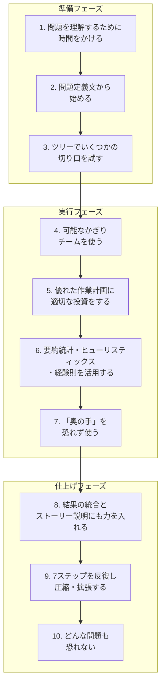

import Callout from '@/components/content/Callout.astro'
import KeyConcept from '@/components/content/KeyConcept.astro'
import Quiz from '@/components/content/Quiz.astro'
import MermaidDiagram from '@/components/content/MermaidDiagram.astro'

## 優れた問題解決者になるための10のポイント

本書の最終章では，これまで学んできた7ステップの問題解決プロセスを実践で活用するための10のポイントを提示する．著者たちがマッキンゼーでのコンサルティング経験，自然保護活動，スタートアップ経営を通じて得た知見を凝縮したものだ．

この10のポイントは独立したものではなく，相互に関連し合いながら，優れた問題解決者としての総合力を形成する．

<MermaidDiagram title="優れた問題解決者になるための10のポイント">

</MermaidDiagram>

### 1. 問題を理解するために時間をかける（急いで分析に入らない）

多くの人がやりがちな間違いは，問題に直面するとすぐに分析やデータ収集に飛びつくことだ．しかし優れた問題解決者は，まず問題そのものを深く理解するために十分な時間を投資する．

問題の背景にある文脈は何か，利害関係者は誰か，なぜ今この問題が重要なのか，過去にどのような試みがなされたのか．こうした問いに答えることなく分析を始めると，間違った問題を精密に解いてしまう——つまり「正しく間違える」リスクが高まる．

<KeyConcept title="正しい問題を解く">
問題解決における最大のリスクは，「間違った問題を正しく解く」ことである．どれほど精密な分析を行っても，解くべき問題自体が間違っていれば，その結果は無意味だ．問題の理解に十分な時間をかけることが，全体の生産性を最も高める投資となる．
</KeyConcept>

### 2. 問題定義文から始める（明確で測定可能な問題定義）

問題を理解したら，次に問題定義文（Problem Statement）を作成する．問題定義文は「意思決定者は誰か」「成功の基準は何か」「制約条件は何か」「スコープ（範囲）はどこまでか」「期限はいつか」を明確にした一文である．

曖昧な問題定義は曖昧な分析を生む．「売上を伸ばすにはどうすべきか」ではなく，「12ヶ月以内に，既存顧客からの売上を15%成長させるために，マーケティング予算2,000万円の範囲でどのチャネルに投資すべきか」というレベルの具体性が求められる．

### 3. ツリーでいくつかの切り口を試す（複数のロジックツリーを検討）

ロジックツリーの作成では，最初のツリーに固執しないことが重要だ．同じ問題でも，異なる切り口で分解すれば，異なるインサイト（洞察）が得られる．

例えば売上の問題を「顧客数×客単価」で分解するのと，「既存顧客の売上＋新規顧客の売上」で分解するのでは，導かれる施策が異なる．著者たちは少なくとも2〜3種類のロジックツリーを試作し，最も分析しやすく，最もインサイトが得られそうなものを選ぶことを推奨している．

<Callout type="tip" title="ロジックツリーの質を上げるコツ">
最初のロジックツリーは「たたき台」と考え，チームメンバーやクライアントに見せてフィードバックを得ることが効果的だ．他者の視点を取り入れることで，自分では気づかなかった切り口や見落としている要素が明らかになる．
</Callout>

### 4. 可能なかぎりチームを使う（多様な視点の確保）

問題解決はチームスポーツである．一人の天才に頼るよりも，多様なバックグラウンドを持つチームメンバーが協力する方が，はるかに優れた解を導ける．

著者たちは，チームの多様性が特に効果を発揮する3つの場面を挙げている．(1) 問題定義の段階で異なる視点からの問いかけが生まれる，(2) ロジックツリーの構築で異なる切り口が提案される，(3) 分析結果の解釈で思い込みによるバイアスが修正される．

ただし，チームを使う際には「集団思考（グループシンク）」の罠を避ける工夫が必要だ．最初に全員に独立して考えさせてから意見を出し合う，あえて反対意見を述べる「悪魔の代弁者」の役割を設定するといった手法が有効である．

### 5. 優れた作業計画に適切な投資をする（仮説駆動のワークプラン）

作業計画（ワークプラン）は，問題解決プロジェクトの設計図である．「誰が，何を，いつまでに，どのように」分析するかを明確にすることで，チーム全体の生産性が劇的に向上する．

優れた作業計画は仮説駆動である．つまり「この仮説を検証するために，このデータを，この手法で分析する」という形で設計される．仮説が明確でないまま「とりあえずデータを集めてみよう」というアプローチは，時間とリソースの浪費につながる．

<KeyConcept title="仮説駆動（Hypothesis-Driven）のアプローチ">
仮説駆動とは，分析の前に「最も可能性の高い答え」を仮説として設定し，その仮説を検証するためにデータを収集・分析するアプローチだ．仮説がなければ，何を分析すべきかが定まらず，無限にデータを集め続けることになる．「Day 1 Answer」の考え方と根底でつながっている．
</KeyConcept>

### 6. 要約統計，ヒューリスティックス，経験則を活用する（まず概算から）

精密な分析に入る前に，まず「大まかな全体像」を掴むことが重要だ．要約統計（平均値，中央値，分布など），ヒューリスティックス（簡便な判断法則），経験則（Rule of Thumb）を活用して，問題の大きさや方向性をざっくりと把握する．

例えば，市場規模の推定では「人口×利用率×単価」という単純な掛け算で概算値を出し，その精度を後から高めていく．いわゆる「封筒の裏の計算（Back of the Envelope Calculation）」であり，この段階で「桁が違う」ことに気づければ，大きな手戻りを防げる．

### 7. 「奥の手」を恐れず使う（高度な分析手法への挑戦）

本書の第7章・第8章で紹介した高度な分析手法——ベイズ統計，機械学習，シミュレーション，ゲーム理論など——を，必要に応じて恐れずに活用することが重要だ．

これらの手法は難しそうに見えるが，現代ではソフトウェアツールの進歩により，専門家でなくてもある程度の分析が可能になっている．重要なのは，手法そのものを完全にマスターすることではなく，「どのような問題に，どの手法が適しているか」を判断できる力を養うことだ．

<Callout type="note" title="分析手法の選び方">
高度な分析手法を選ぶ際の判断基準は，(1) 問題の構造が手法の前提と合っているか，(2) 必要なデータが入手可能か，(3) 結果が意思決定者に理解・説明できるか，の3点だ．最も複雑な手法が最も良いわけではない．問題に対して「十分に正確で，十分にシンプルな」手法を選ぶことが実践的である．
</Callout>

### 8. 分析と同程度，結果の統合とストーリーの説明にも力を入れる

分析がどれほど優れていても，その結果が意思決定者に正しく伝わらなければ意味がない．著者たちは，分析に費やすのと同程度のエネルギーを，結果の統合（Synthesis）とストーリーテリングに投資すべきだと強調する．

統合とは，個々の分析結果を組み合わせて「全体としてのメッセージ」を導き出すプロセスだ．個別の分析はそれぞれ正しくても，全体を通したストーリーが矛盾していたり，論理の飛躍があったりすれば，説得力は失われる．

ストーリーテリングでは，「ピラミッド構造」——結論を最初に述べ，それを支える根拠を階層的に提示する——が効果的だ．聞き手の立場に立ち，「なぜこの結論に至ったか」ではなく「この結論が聞き手にとって何を意味するか」を中心に構成する．

### 9. 7ステップのプロセスを反復し，ときには圧縮・拡張する

7ステップのプロセスは厳格なルールではなく，柔軟なフレームワークだ．問題の性質や時間の制約に応じて，ステップを圧縮したり拡張したりすることが実践では重要である．

緊急の意思決定では，問題定義から分析まで数時間で駆け抜ける「圧縮版」が必要になることもある．一方で，第9章で扱ったような厄介な問題では，問題定義のステップだけで数週間を要する「拡張版」が適切だ．

また，プロセスは直線的に進むものではなく，常に前のステップに立ち返る反復（Iterate）が不可欠である．分析の途中で問題定義が間違っていたことに気づけば，Step 1に戻る勇気を持つことが，最終的な成果の質を決定する．

<KeyConcept title="プロセスの柔軟な適用">
7ステップのプロセスは「レシピ」ではなく「フレームワーク」である．状況に応じてステップの順序を入れ替え，重要なステップに多くの時間を割き，不要なステップを省略する柔軟性が求められる．固定的にプロセスに従うことが目的ではなく，最善の解に到達することが目的だ．
</KeyConcept>

### 10. どんな問題も恐れない（自信を持って取り組む姿勢）

最後のポイントは，マインドセットに関するものだ．本書で学んだ7ステップのアプローチは，ビジネスの戦略問題，個人のキャリア選択，公共政策，そして厄介な社会問題まで，あらゆる領域に適用できる．この事実を理解し，自信を持ってどんな問題にも取り組む姿勢が，優れた問題解決者の最も重要な資質である．

著者たちは，複雑な問題に直面したときに「自分には解けない」と思う必要はないと述べる．問題が大きすぎると感じたら分解すればよい．データが足りないと感じたら概算から始めればよい．正解がわからないと感じたら仮説を立てて検証すればよい．7ステップのプロセスは，どんな状況でも「次に何をすべきか」を教えてくれる羅針盤なのだ．

<Callout type="tip" title="問題解決者としての成長">
問題解決のスキルは，実践を通じて磨かれる．本書で学んだフレームワークを日常の意思決定に意識的に適用し，「問題定義→分解→優先順位→分析→統合」のサイクルを繰り返すことで，問題解決力は着実に向上する．最初はぎこちなくても，繰り返すうちに無意識レベルで構造的思考ができるようになる．
</Callout>

## 第10章のまとめ

本書「完全無欠の問題解決」は，マッキンゼーで培われた7ステップの問題解決アプローチを，ビジネスパーソンだけでなくすべての人が活用できる形で体系化したものだ．

最終章で示された10のポイントは，このアプローチを実践する上での行動指針となる．問題の理解に時間をかけ，明確な問題定義文を作り，複数のロジックツリーを試し，チームの力を活用し，仮説駆動の作業計画を立て，概算から始め，高度な手法も恐れず使い，統合とストーリーテリングに力を注ぎ，プロセスを柔軟に適用し，そしてどんな問題にも自信を持って取り組む．

問題解決は生まれつきの才能ではなく，訓練によって磨かれるスキルだ．本書のフレームワークを自分のものにし，日々の意思決定に適用し続けることが，優れた問題解決者への道である．

<Quiz questions={[
  {
    question: "著者たちが「問題解決における最大のリスク」として指摘しているのはどれか？",
    options: ["分析に時間をかけすぎること", "データが不足していること", "間違った問題を正しく解いてしまうこと", "チームメンバーの意見が合わないこと"],
    answer: 2,
    explanation: "問題解決における最大のリスクは「間違った問題を正しく解く」ことです．だからこそ，問題の理解と定義に十分な時間をかけることが重要であると著者たちは強調しています．"
  },
  {
    question: "「仮説駆動（Hypothesis-Driven）」のアプローチの特徴として正しいものはどれか？",
    options: ["データをすべて集めてから仮説を立てる", "最も可能性の高い答えを仮説として設定し検証する", "仮説は一度立てたら変更しない", "仮説なしでデータのパターンを探る"],
    answer: 1,
    explanation: "仮説駆動アプローチでは，分析の前に「最も可能性の高い答え」を仮説として設定し，その仮説を検証するためにデータを収集・分析します．仮説は新しい情報に基づいて修正していきます．"
  },
  {
    question: "7ステップのプロセスの実践的な運用について，著者たちの主張はどれか？",
    options: ["7ステップは必ず順番通りに実行すべきである", "問題の性質に応じてステップを圧縮・拡張し柔軟に適用すべきである", "厄介な問題には7ステップは適用できない", "ステップ1からステップ7まで一度だけ通して完了させるべきである"],
    answer: 1,
    explanation: "著者たちは，7ステップのプロセスは「レシピ」ではなく「フレームワーク」であり，問題の性質や時間の制約に応じて柔軟に圧縮・拡張し，反復（Iterate）しながら適用すべきだと主張しています．"
  }
]} />
