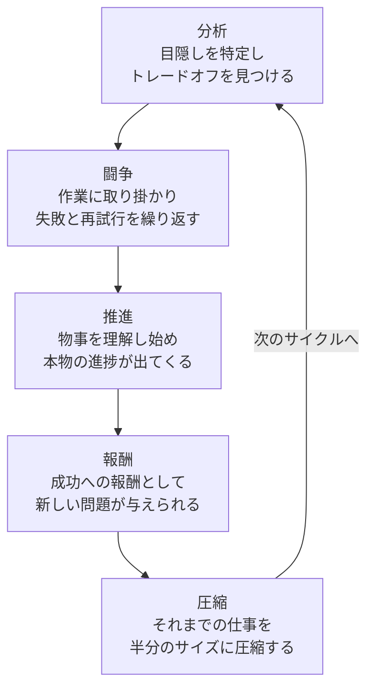

import Callout from '@/components/content/Callout.astro'
import KeyConcept from '@/components/content/KeyConcept.astro'
import Quiz from '@/components/content/Quiz.astro'
import MermaidDiagram from '@/components/content/MermaidDiagram.astro'

## リーダーとしてスケールする

複数チームをまとめて管理するということは，それまで以上にハイレベルで，それまで以上に多くの決定を行うことを意味する．仕事は特定のエンジニアリングタスクの解決方法というより，ハイレベルの戦略に関連するものが多くなる．

本章では，リーダーとして効果的にスケールするための3つの主要原則を紹介する．

- **いつでも決定せよ** -- 曖昧な問題に対してトレードオフを見つけ出し，反復的に決定を行う
- **いつでも立ち去れ** -- 自分がいなくても機能する自動運転組織を構築する
- **いつでもスケールせよ** -- 増大する責務に対して自分自身のリソースを保護する

## いつでも決定せよ

最もハイレベルなところにあるリーダーとしての仕事は，難解で曖昧な問題の解決へと人々を導くことである．曖昧（ambiguous）という語が意味するのは，問題に明白な解法がなく，解決不能なことすらあるかもしれないということだ．

<KeyConcept title="決定の3ステップ">
リーダーが曖昧な問題を解決するプロセスには3つのステップがある．まず**目隠しを特定**し，次に**トレードオフを特定**し，それから**決定して反復**する．完璧な解を求めるのではなく，現時点での最良の判断を行い，必要に応じてバランスを再調整していくことが重要である．
</KeyConcept>

### 目隠しを特定せよ

ある問題に初めてアプローチする際に，既にその問題と何年も戦っている人々が「目隠し」を装着していることがしばしばある．長い間その問題に浸かっていたために，もはや森を見ることがかなわないのだ．「これが，我々がずっとやってきたやり方なんだ」と言い，現状を批判的に検討する能力を失ってしまっている．無垢な眼差しを備えた者が，この目隠しの存在に気づき，新しい戦略を検討できる．

### 鍵となるトレードオフを特定せよ

重要かつ曖昧な問題には，魔法の「銀の弾丸」としての解法がない．全ての状況で永久に有効な答えなどというものはなく，現時点で最良の答えのみが存在する．その答えはほぼ確実に，色々な方面でのトレードオフの実行を伴う．トレードオフ群を指摘し，それらを皆に説明して，どのようにバランスを取るかという決定を補助するのが，リーダーの務めである．

### 決定し，それから反復せよ

トレードオフ群を理解したら，その特定の月にはトレードオフの情報を用いて最良の決定を下す．次の月には再評価しバランスを再調整しなければならないかもしれない．これは反復的プロセスである．チームが反復の際も居心地良く過ごせるようにしなければならない．

<Callout type="note" title="ケーススタディ：ウェブ検索のレイテンシー">
Googleのウェブ検索では，検索結果の「品質」を追求する過程で，レイテンシーが徐々に増大していた．この問題に対し，**品質（良い）・レイテンシー（速い）・処理能力（安い）** の3つのトレードオフを明確化した「鉄の三角形」の視点を導入した．レイテンシーを第一級のゴールとして扱うことで，品質改善とレイテンシー損害を定量的に比較し，データ駆動な意思決定が可能になった．
</Callout>

## いつでも立ち去れ

**いつでも立ち去れ**という名言は，Googleの元エンジニアリングディレクターBharat Medirattaのものである．曖昧な問題を解くことだけが仕事なのではなく，自分が居合わせなくても組織自体がその問題を解けるようにすることも仕事であるということだ．

<KeyConcept title="自動運転チームの構築">
成功するリーダーであることは，難しい問題を解ける組織を構築することを意味する．そのような組織には，強力なリーダー陣，健全なエンジニアリングプロセス，そして時間が経過しても存続する建設的文化が必要である．自給自足的な集団を構築するための3つの要素は，**問題空間を分割すること**，**部分的問題を移譲すること**，**必要に応じて反復すること**である．
</KeyConcept>

### 問題空間の分割

解決困難な問題は通常，複数の難しい部分的問題から成る．1つのチームに各1つの部分的問題を担当させるのが自明な選択だが，部分的問題は時間の経過とともに変化する可能性があるため，緩い組織構造を検討すべきである．「厳格すぎる」と「曖昧すぎる」の間の紙一重のバランスを取ることが求められる．

Google検索のレイテンシー問題では，レイテンシーの**症状**に対処する作業と，レイテンシーの**原因**に対処する作業に問題を分割した．各チームが特定の解法ではなく各問題のオーナーとなることで，長期にわたってレイテンシーを組織的に制御できるようになった．

### 部分的問題を部下のリーダーたちへ移譲する

移譲は学ぶのが本当に難しい．効率と成果に関する直感全てに反するからだ．しかし，自足するリーダー陣を育成しなければならず，移譲は最も効果的なリーダー訓練方法である．「高速に失敗し，そして反復する」という哲学は，エンジニアリングの設計だけでなく人間の学習にも当てはまる．

<Callout type="danger" title="リーダーが自問すべき2つの質問">
タスクの実行前に「**本当に自分がこの仕事をできる唯一の者なのだろうか**」と自問すべきである．自分でやるのが最も効率的かもしれないが，それでは部下のリーダーたちを育て損ねている．毎日仕事を始めるときに「**自分のチームの他の誰もできはしないどんなことを自分はできるだろうか**」と問いかけるべきだ．その最も一般的かつ重要な答えは，「ハイレベルの戦略を定義できる」ということである．
</Callout>

### 調整と反復

自己持続型の機械を構築できたら，穏やかなやり口で方向付けと調整を行う．これこそが優れたマネジメントの何たるかであり，**95%は観察と傾聴で，5%はちょうど正しい場所に決定的に重要な調整を加えること**である．マイクロマネジメントではなくマクロマネジメントを行うべきだ．

### チームの自己同一性の固定に注意する

チームに一般的問題ではなく特定製品を担当させるのはよくある誤りだ．製品は問題への解であり，より良い解によって取って代わられる可能性がある．チームが**問題**を担当する（例：「我々は会社にバージョンコントロールを提供するチームである」）ならば，様々な解を長期的に実験できる．

## いつでもスケールせよ

リーダーとして最も貴重なリソースは時間，注意力，エネルギーの限りある蓄えである．増大する責務に対して，効果的に自分自身をスケールさせる方法が必要だ．

### 成功の周期

チームが困難な問題に取り組む場合に現れる標準的な周期がある．

<MermaidDiagram title="成功の螺旋サイクル">

</MermaidDiagram>

この成功の螺旋は，組織が新しい問題に取り組むことでスケールしていき，問題を圧縮する方法を編み出していくというパラダイムである．問題を圧縮する行為は，自分のチームの効率を最大化させる方法の理解だけでなく，自身の時間と注意力を新しい責任範囲に見合うようスケールさせることにも関わる．

### 「重要」対「緊急」

<KeyConcept title="重要なもの対緊急なもの">
Eisenhowerの言葉の通り，「緊急なものは重要ではなく，重要なものは絶対に緊急ではない」．純粋に反応して行動するモードに陥ると，緊急だが重要ではないものに全時間を費やすことになる．リーダーとしての仕事はハイレベルの戦略を定義する等の**自分しかできないことをやること**であり，メタ戦略の構築は信じがたいほどに重要だが緊急であることはほぼない．
</KeyConcept>

対策として以下のテクニックがある．

- **移譲** -- 緊急なことの多くは組織内の他のリーダーたちに差し戻して移譲できる
- **専用の時間の予定を入れる** -- 定期的に2時間以上を押さえて，重要だが緊急ではない物事のみについて作業する
- **機能する追跡システムを見つける** -- David Allenの「GTD」のような，タスクを消化するための抽象的なアルゴリズムを活用する

### ボールを落とすことを学べ

近藤麻理恵の片づけ哲学を応用し，自分に投げかけられてくるタスクの最上位20%に厳密に専念すべきである．他の80%を落とすことを自身に明示的に許可しなければならない．

非常に多くのボールを故意に落とすにつれて，素晴らしいことを2つ発見する．第一に，中間の60%のタスクを移譲しなくても，部下のリーダーたちがしばしば気づいて自動的にそれらを拾い上げる．第二に，中間バケット内の何かが真に決定的に重要なら，いずれにせよ自分のところへ戻ってきて上位20%に移ってくる．

### 自分のエネルギーを保護する

自分の時間と注意力を保護するだけでなく，個人のエネルギーも管理しなければならない．

- **「本物」の休暇を取る** -- リフレッシュには少なくとも1週間が必要で，仕事のメールを確認してはいけない
- **つながりを断つことが大したことではないようにする** -- 仕事用ラップトップは職場に置き，携帯電話の仕事用プロファイルを無効化する
- **「本物」の週末休みも過ごす** -- 金曜の夜に仕事用アカウントからサインアウトする
- **日中に休憩する** -- 脳は自然に90分周期（BRAC）で動作しており，微小な休憩が大きな差異をもたらす
- **メンタルヘルスの日を取ることを自分に許す** -- 調子が悪い日に能動的に損害を引き起こすより，何も行わない方がましだ

<Callout type="tip" title="エネルギーの管理">
自分のエネルギーの管理は自分の時間の管理と全く同じくらいに重要である．長期的にはキャリアを重ねると総合的なスタミナが増強されてくる．マラソンの訓練と同様に，時間の経過に伴って脳と体がスタミナの蓄えをより大きなものへと増強する．
</Callout>

## 結論

成功しているリーダーは，進むにつれて引き受ける責務が自然に増える．期待に応える能力を実際に発揮するリーダーであるためには，完璧な決定をしたり自身で何でも行ったり2倍働いたりしなければならないわけではない．むしろ，**いつでも決定し，いつでも立ち去り，いつでもスケールする**よう努力するべきだ．

## 要約

- **いつでも決定せよ** -- 曖昧な問題への魔法のような答えはない．現時点での正しいトレードオフを見つけて反復することが対処の全てだ
- **いつでも立ち去れ** -- リーダーとしての仕事は，自分が居合わせる必要なしに曖昧な部類の問題を自動的に解決する組織を構築すること
- **いつでもスケールせよ** -- 時間の経過とともに成功はさらなる責務を生み出す．個人的な時間，注意力，エネルギー等のリソースを保護すべく，責務が増加する作用のスケーリングを率先して管理しなければならない

<Quiz questions={[
  {
    question: "リーダーが曖昧な問題を解決するための3つのステップの正しい順序はどれか？",
    options: [
      "トレードオフを特定→目隠しを特定→決定して反復",
      "目隠しを特定→トレードオフを特定→決定して反復",
      "決定して反復→目隠しを特定→トレードオフを特定",
      "目隠しを特定→決定して反復→トレードオフを特定"
    ],
    answer: 1,
    explanation: "まず目隠し（既存の思い込み）を特定し，次にトレードオフを特定し，それから決定を行って反復するという順序が正しい．"
  },
  {
    question: "「いつでも立ち去れ」の原則において，リーダーが避けるべきアンチパターンは何か？",
    options: [
      "チームに問題を移譲すること",
      "自分を単一障害点（SPOF）に仕立て上げること",
      "新しい問題に取り組むこと",
      "チームの自己同一性を問題に固定すること"
    ],
    answer: 1,
    explanation: "自分を単一障害点にしてしまうと，自分が不在のときにチームが機能しなくなる．自動運転組織を構築し，自分がいなくてもチームが成功を続けられるようにすべきである．"
  },
  {
    question: "近藤麻理恵の哲学を応用したタスク管理において，リーダーが専念すべきタスクの割合はどれか？",
    options: [
      "底辺の20%を捨て，残り80%に取り組む",
      "上位80%に取り組み，底辺20%を無視する",
      "最上位の20%に厳密に専念し，他の80%を落とす",
      "中間の60%に集中し，上下の20%ずつは無視する"
    ],
    answer: 2,
    explanation: "決定的に重要な最上位20%のボールに完全に専念し，他の80%を落とすことを自身に明示的に許可すべきである．中間の60%は部下のリーダーが自動的に拾い上げるか，真に重要なものは上位20%に戻ってくる．"
  }
]} />
