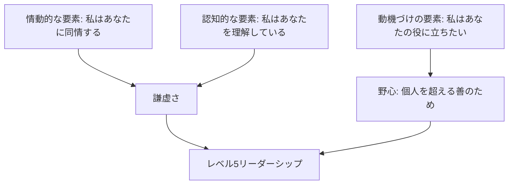

import Callout from '@/components/content/Callout.astro'
import KeyConcept from '@/components/content/KeyConcept.astro'
import Quiz from '@/components/content/Quiz.astro'
import MermaidDiagram from '@/components/content/MermaidDiagram.astro'

## リーダーシップと社会的技能

> 二年かけてほかの人に関心をもってもらおうとするより，二か月かけてほかの人に心の底から関心をもつほうが，多くの友人が作れる．友人を作るには友人になるにかぎる．――デイル・カーネギー

この章では，人に好かれ，しかも自分の分野で成功するのを助ける情動的な技能を考える．人に好かれる方法を説く本もあれば，成功のしかたを説く本もあるが，この本からはその両方が学べる．

### 人に愛されるのはあなたのキャリアのためになる

リーダーシップ研究の高名な学者，ジム・クーゼスとバリー・ポズナーは，管理職の成功を説明する数々の要因を調べた．すると，上位四分の一と下位四分の一をはっきり分ける要因が，ただひとつだけあった．それは愛情――人を愛することと人から愛されたいという願望の両方――での得点の高さだった．非常に優秀な管理職は，成績の劣る管理職よりも，他人に対して多くの温かさと好意を見せ，人と近しくなり，大きく心を開いて考えや気持ちを伝える．

物事を成し遂げる最も効果的な方法は，冷徹な人間のように振る舞うことだと考える実業界の人にとって，この研究は新鮮な可能性を示す．好かれることを諦めてまで物事を成し遂げる必要はなく，両立は可能なのだ．長い目で見れば，人に好かれるのが，物事を成し遂げる最も効果的な方法かもしれない．

<KeyConcept title="好かれることと成功の両立">
有能な管理職を際立たせる唯一の要因は，人を愛し，人から愛されたいと願う度合いの高さだった．好かれることと成功することは対立せず，むしろ人に好かれることこそが，長い目で見れば最も効果的に物事を成し遂げる方法になりうる．
</KeyConcept>

### 優しさを使い，険悪な状況から友好関係を育む

たとえ難しい状況でも，重要なことを成し遂げながら幸せな友好関係を生み出せる場合がある．それには優しい気持ちと，開かれた心と，適切な社会的技能が必要だ．

著者には，社内システムを構築するジョーという優秀な同僚がいた．そこへサムという新しい管理職が入り，数週間のうちにジョーに解雇手続きを告げた．著者はジョーを助けたいと思ったが，新しい上司サムと正面から対決すれば険悪な事態になりかねなかった．

そこで著者はマインドフルネスで心を鎮め，「私とまったく同じ」の瞑想（第7章を参照）を使ってサムの身になってみた．すると，自分の知らない重要なデータが欠けているに違いないと気づき，怒りが消え，優しさと好奇心が湧いてきた．著者はサムに，歓迎の言葉と，決定の背後にある理由を理解したいという願いを，無理強いしない形で丁寧に伝えるメールを書いた．

サムは優しさと真心をもって応じ，ふたりは会って話した．その会話から，著者はジョーが顧客の注文を無節操に引き受けチームの目標を無視していたことを知り，サムはジョーが顧客から高く評価されていることを知った．双方が欠けていたデータを手に入れたのだ．まもなくサムとジョーは再び話し合い，協力する方法を見つけ，解雇手続きは打ち切られた．険悪なドラマに発展しかねなかった状況が，長い友情の出発点になった．

<Callout type="note" title="実社会こそが道場">
中国の禅の格言に「大なる隠者は皇帝の宮廷に隠れる」とある．情動的な技能は実社会で応用できてこそ意味がある．誘惑と危険に満ちた実社会こそが，情動的な技能を磨くのに打ってつけの道場なのだ．
</Callout>

この章では，不可欠の社会的技能を三つ学ぶ．思いやりのあるリーダーシップと，善意に基づく影響力の行使と，洞察力にあふれたコミュニケーションだ．

## 思いやりのあるリーダーシップ

思いやりは，あらゆる信仰の伝統で偉大な徳として知られているが，それだけではない．思いやりは，これまで測定されたなかで最高水準の幸せの原因であるとともに，最も効果的な形のリーダーシップの必要条件でもある．

### 思いやりは最も幸せな状態

著者の友人で「世界一幸せな人」と呼ばれるマチウ・リカールは，脳をfMRIでスキャンすると幸せの測定値が極端に高かった．彼を含むチベット仏教の瞑想の達人たちが測定中に考えていたのは，意外にも思いやりだった．思いやりは不愉快な心の状態だと考える人が多いが，科学的データはその正反対を示している．思いやりは極端に幸せな状態なのだ．

マチウによれば，思いやりは文句なく最も幸せな状態で，二番目は「開かれた意識」――心が極端に開放的で，穏やかで，明瞭な状態――だという．穏やかさは世間からの隔絶で深まるが，一番幸せな状態は思いやりをもってしか達成できず，それには生身の人間との実生活に携わらなければならない．だから瞑想の修行には，世間からの隔絶（穏やかさのため）と，世間とのかかわり合い（思いやりのため）の組み合わせが必要だ．

思いやりは楽しいものとなりうると知れば，話が一変する．思いやりに基づく行為がつらい仕事なら誰もやらないが，楽しいものなら誰もがやるだろう．思いやりを世界中に広げるには，思いやりに基づく行為は楽しいという認識を広めるだけでいいのだ．

### 思いやりのあるリーダーシップこそが最も効果的なリーダーシップ

チベットの学者トゥプテン・ジンパは，思いやりを次のように定義する．思いやりとは，他者の苦しみに対する気遣いの感覚と，その苦しみが取り除かれるようにしたいという強い願望とを伴う心の状態である．具体的には三つの要素からなる．

1. 認知的な要素――「私はあなたを理解している」
2. 情動的な要素――「私はあなたに同情する」
3. 動機づけの要素――「私はあなたの役に立ちたい」

メドトロニック社の元CEOビル・ジョージは，正真正銘のリーダーになる最も重要なプロセスを，「私」から「私たち」への移行と表現した．思いやりの実践とは自己から他者へ移ることであり，まさに「私」から「私たち」への移行と言える．だから思いやりを実践する人は，正真正銘のリーダーになるやり方をすでに知っていて，一歩先んじることになる．

ジェームズ・コリンズは『ビジョナリー・カンパニー2――飛躍の法則』で，優良な企業を卓越した企業に育てるには特殊な「レベル5」リーダーが必要だと示した．レベル5リーダーは，一見相反するふたつの特質を併せもつ．大きな野心と謙虚な態度だ．彼らは野心的だが，その焦点は自分自身ではなく，個人の利益を超える善に向いている．

<KeyConcept title="思いやりがレベル5リーダーを育てる">
思いやりの認知的・情動的な要素（理解と共感）は，極端な自己中心癖を和らげて謙虚さの土台を生み出す．人の役に立ちたいという動機づけの要素は，個人の利益を超える善への野心を生み出す．つまり思いやりの三要素が，レベル5リーダーを際立たせる謙虚さと野心を鍛えるのだ．
</KeyConcept>

思いやりはレベル5リーダーシップの必要条件であり，レベル5リーダーを育てる手始めに思いやりのトレーニングをするのも一法だ．

<MermaidDiagram title="思いやりの三要素がレベル5リーダーシップを育てる">

</MermaidDiagram>

### 善良さを伸ばすことで思いやりの力を鍛える

私たちは心の習慣を生み出すことで思いやりの力を鍛えられる．何かについて考えれば考えるほど，その思考につながる神経の経路が強化され，やがて頻繁に苦もなくその考えが浮かぶようになる．思いやりのトレーニングに使う心の習慣は，強力でありながら快くもある．それが善良さだ．自分の中の善良さと他人に対する善良さの両方を捉えて増やす心の能力を伸ばしていく．

この練習では視覚化も使う．息を吸い込むときに自分の善良さを吸い込み，心の中でそれを一〇倍にし，吐き出すときにその善良さをすべて世の中に与えるところを視覚化する．お望みなら善良さを白い光として思い描いてもよい．

#### エクササイズ――善良さを増す瞑想

1. 心を落ち着ける――まず二分間，心を呼吸に集中させる．
2. 自分の善良さに心を向ける――愛情や思いやり，利他主義，内なる喜びといった自分の中の善良さに心を向ける．それがほのかな白い光として体から放射されているところを視覚化してもよい．
3. 善良さを増やして与える――息を吸い込むときに自分の善良さをすべて吸い込み，心を使ってそれを一〇倍にする．息を吐き出すときに，その善良さを全世界に向けてそっくり吐き出す．
4. 他人の善良さに広げる――知っているあらゆる人の中の善良さに心を向け，同じことを繰り返す．次に世界のあらゆる人の中の善良さに心を向け，再び繰り返す．
5. 結び――一分間，心を呼吸に集中しておしまいにする．

この練習は三つの有益な心の習慣を育む．自分と他人の中に善良さを見ること，善良さをすべての人に与えること，そして自分の中にある変える力を信頼することだ．善良さを見る習慣は思いやりの情動的・認知的な要素を，善良さを与える習慣は動機づけの要素を，変える力への信頼は自信を強めてくれる．

### 勇敢な人のための思いやりのトレーニング

思いやりを育む伝統的な練習は「トングレン」（チベット語で「授受」の意）として知られる．「善良さを増す」練習とよく似ているが，善良さを吸い込むかわりに，自分と他人の苦しみを吸い込み，それを自分の中で変え，息を吐くときに愛と優しさと思いやりを放射する．苦しみを吸い込む必要があるため，入門者にはとても難しい．勇気ある人だけ試してほしい．

#### エクササイズ――トングレンの瞑想

1. 落ち着く――自分の体と呼吸を意識し，息の出入りにそっと注意を集中する．深く息を吸い，吐くときに自分が山のように感じられるところを想像する．
2. 自分自身のトングレン――目の前に座っている「通常の自分」が苦しんでいるところを想像し，その苦しみを黒雲のように吸い込み，それが散り散りになって姿を変えるにまかせ，光の筋として吐き出す．このサイクルをしばらく繰り返す．
3. 他人のためのトングレン――苦しんでいる人が目の前にいるところを想像し，その苦しみを黒雲として吸い込み，利己主義を消し去って善良さを明らかにし，光の筋を吐き出して苦しみを軽くすることに意図を定める．
4. 結び――数分間，胸に手を当てて，ただ呼吸を繰り返す．

トングレンはとても強力な練習で，ダライ・ラマも毎日の主要な修行のひとつにしている．著者は初めてこの練習をしたとき，わずか数分のうちに自信が永久に強まるのを経験した．自分を引き止めていたのは痛みと苦しみへの恐れであり，それを吸い込んで優しさと愛を発散できるとわかると，束縛の多くが消えてなくなった．

<Callout type="tip" title="まず善良さを増す練習から">
SIYでは多くの参加者にとってトングレンが難しすぎたため，初心者でも習得しやすい「善良さを増す」練習を新たに創り出した．これはトングレンの予告編にもなる．まず「善良さを増す」練習で自信をつけ，数週間かけて慣れてからトングレンを試すとよい．
</Callout>

## 善良さをもって影響力を揮う

影響力にまつわる第一の原則は，私たちはみなすでに影響力をもっているということだ．私たちがすること，しないこと，言うこと，言わないことは，すべて他人に影響を与える．カギは，影響力を獲得することではなく，すでにもっている影響力を拡大し，みんなのために行使することだ．

### 社会的な脳を理解する

自分の影響力を拡大する最も重要な第一歩は，社会的な脳を理解して巧みに操縦することだ．神経科学者エヴィアン・ゴードンによれば，「危険を最小化し，報酬を最大化する」原理は脳にとって何よりも大切な組織化原理だという．脳は基本的に，報酬には接近し，脅威は回避する機械だ．

ただし，脅威への反応は報酬への反応よりもずっと大きい．人間の脳は，ネガティブな経験に対して，それに匹敵するポジティブな経験よりもずっと強く反応する．廊下で誰かが微笑み返してくれた経験はすぐ忘れるが，無視された経験は何分も，もっと長く頭に残る．

ポジティブな経験を何回すればネガティブな経験を帳消しにできるか．心理学者バーバラ・フレドリックソンはその割合を三対一と示した．一方，ジョン・ゴットマンは，結婚生活が成功するにはポジティブなやりとりがネガティブなやりとりの少なくとも五倍必要だと発見した（ゴットマンの割合）．日常には三対一を，結婚生活にはさらに法外な五対一を私たちは求めているのだ．

<Callout type="info" title="ネガティビティ・バイアス">
人間の脳はネガティブな経験に強く反応し，長く記憶にとどめる．だからこそ私たちはポジティブな経験を法外な割合（日常で三対一，結婚生活で五対一）で求める．この偏りを理解すれば，配偶者や周囲の人にもっと優しい待遇を与える余地が見えてくる．
</Callout>

### 社会的な脳の「SCARFモデル」

デイヴィッド・ロックは著書『作動する脳』で，脳がおもな報酬あるいは脅威として扱う五つの社会的経験の領域を説明した．脳はこの五領域を生存にかかわる問題と同等に扱う．頭文字をとって「SCARFモデル」と呼ばれる．

- 地位（Status）――相対的な重要性や序列のこと．私たちは大変な努力で地位を守ろうとし，地位への脅威はごく簡単に引き起こされる．他人を害さず地位を上げる良い方法は「自分との競争」で，技能を向上させれば過去の自分と比べて地位の報酬が得られる．
- 確実性（Certainty）――脳は確実性を好む．不確実性は脳に「エラー応答」を引き起こし，貴重な資源を掠奪する．職が安泰か不確実だと頭がそれでいっぱいになり，ろくに仕事にならない．
- 自律性（Autonomy）――自分の環境を支配しているという認識．人を悩ませるのはストレス自体ではなく，それに直面したときに抱く無力感だ．イギリスの下級公務員は上級管理職よりストレス関連の健康問題を多く抱えていた．
- 関係性（Relatedness）――相手が「敵」か「味方」かという認識．脳は相手が敵でないと判明するまで敵というレッテルを貼るが，握手と快い会話だけで味方に変えられる．ウォーレン・バフェットは「自分を愛してもらいたい人のうち何人に実際に愛してもらっているか」で人生の成功を測るという．
- 公平性（Fairness）――自分の利益を損ねてまで不公平を罰するのは人間だけだ．「最後通牒ゲーム」で不公平な配分を提示されると，多くの人は金銭的に損をしてでもそれを退ける．チンパンジーは決して提示を退けない．人間の公平感は決して見くびってはならない．

### 影響力を広げる

人々に最も効果的に影響を与えられるのは，人々が望むことを達成するのを助けるときだ．それも，自分にも役立ち，個人の利益を超えるもののためにもなる形で．SCARFモデルを理解すれば，自分の行動が自分と他者のためにSCARF要因をどう強化できるかがわかる．たとえば，相手を人間のレベルで知れば関係性の報酬を増やせ，他人の名案を認めれば地位の報酬を増やせる．

<KeyConcept title="影響力を広げる4ステップ">
1. 自分にはすでに影響力があることを知る．すでにある能力に手を加えて向上させるだけだ．
2. 自信を深める．自分の長所と短所を気兼ねなく受け入れるほど自信が深まる．人は優しさと信頼性に裏打ちされた自信に惹かれる．
3. 他人を理解して彼らが成功するのを助ける．自分の目標達成も助ける形で，相手の目標達成を助ける．
4. 個人の利益を超えるもののために尽くす．チームや企業，世の中のためにも行動し，他人の意欲をかき立てる．
</KeyConcept>

これらの練習をたった一語でまとめれば，「善良さ」だ．善良さは人をおおいに奮い立たせ，人を変えるきっかけになる．だからマハトマ・ガンディーはあれほど影響力があったのだ．

### 一〇分間で善良さが人生を変えられる

有名な心理学者ポール・エクマン博士は，ひどい少年時代を送ったため大人になっても怒りに満ち，毎週少なくとも二度は怒りを爆発させていた．二〇〇〇年，ダライ・ラマ臨席のインドの会議に招かれた彼は，会議の合間にダライ・ラマと一〇分ほど話をした．会話のあいだずっと，ダライ・ラマはポールの手を握っていた．

この一〇分でポールは自分の全存在に善良さが満ちあふれるのを経験し，怒りがすっかり消えていった．その後何週間も怒りは跡形もなかった．それだけでなく，引退を考えていたポールは，この世に恩恵をもたらしたいという深い志を再発見し，引退計画を白紙に戻して，人々の情動的なバランスを助ける科学研究に経験と知恵を捧げ続けている．

善良さはとても強力で，わずか一〇分経験するだけでもひとりの人生を変えうる．ダライ・ラマ自身は何も特別なことはしておらず，ポールが経験した善良さはポール自身がその場にもたらしたものだという．いずれにせよ，人に影響を与えたければ，善良さほど大きな力はない．

## 洞察力にあふれたコミュニケーション

共感は効果的なコミュニケーションに不可欠だが，共感だけではいつも十分とは言えない．そこに欠けているのは洞察力で，具体的には，かかわるアイデンティティの問題や，意図と実際にそれが引き起こした影響との落差といった，隠れた会話の要素に対する洞察だ．

### 厄介な会話

厄介な会話とは，重要だが交わすのが難しく，避けたくなる会話だ．昇給を求める会話や，価値ある従業員に批判的なフィードバックを与える会話が典型例だが，ゴミの出し方を隣人に頼むような些細なものでも厄介な会話になりうる．ハーヴァード交渉プロジェクトに連なる『言いにくいことをうまく伝える会話術』の著者たちによれば，厄介な会話をこなすには五つのステップがある．

1. 「三つの会話」を予行演習することで準備する
2. 話題を切り出すかどうか決める
3. 客観的な「第三者の話」から始める
4. 相手の話と自分の話を吟味する
5. 問題を解決する

どんな会話でも，実際には三つの会話が同時に行なわれている．内容に関する会話（「何があったか」），気持ちに関する会話（「どんな情動がかかわっているか」），アイデンティティに関する会話（「ここから自分について何がわかるか」）だ．アイデンティティに関する会話には，次の三つの疑問のうちどれかがかならずかかわっている．

1. 私は有能か？
2. 私は善良な人間か？
3. 私は愛される価値があるか？

「第三者の話」とは，状況全体を把握している公平無私な第三者の立場から見た物事の起こり方だ．これは最も客観的で，相手と共通の基盤を築きやすいので，厄介な会話を始めるのに最もふさわしい．第三者の話で相手を誘い，パートナーとしていっしょに状況を整理してもらう．そのうえで相手の話に耳を傾けて共感し，自分の話を伝え，責め合いをやめて，双方の重要な関心に応える解決策を考える．

### 厄介な会話のための洞察とエクササイズ

SIYの練習を重ねた人は，厄介な会話に必要な技能の大半をすでに身につけている．あとはふたつのカギとなる洞察を手に入れればよい．

<KeyConcept title="影響は意図とは違う">
私たちは自分のことを自分の意図で評価するが，他人のことはその人の行動の影響で評価する．相手の意図はわからないので，影響に基づいて意図を推定するのだ．だが多くの場合，影響は意図とは違う．傷ついたからといって相手に悪意があったとは限らない．影響を伝えてもよいが，喧嘩を始めてはいけない．
</KeyConcept>

第二の洞察は，厄介な会話にはいつも，内容と情動のほかにアイデンティティというもっと重要な問題が絡んでいるというものだ．アイデンティティの問題は最も見えづらく口にされないことが多いが，たいてい最も支配的だ．コミュニケーションの名手はそれに気づき，会話の始めに相手の能力への信頼を請け合うなど，アイデンティティの問題に真っ先に対処する．

#### エクササイズ――厄介な会話に備える

これは書くエクササイズとしても，信頼できる人に話すエクササイズとしてもできる．

1. これまでに経験した，または近い将来しようとしている厄介な会話を思い浮かべる．
2. 自分の視点から「三つの会話」（内容・気持ち・アイデンティティ）を説明する．アイデンティティの会話では，「私は有能か」「私は善良な人間か」「私は愛される価値があるか」のどれがかかわっているかを識別する．
3. 今度は相手になったふりをして，できるかぎり相手の立場から三つの会話を説明する．

### マインドフルな電子メール

現代のコミュニケーションの素晴らしさは，面と向かってしなくてよい点であり，まずさも面と向かってしない点だ．メールの最大の欠点は，情動的な内容が誤って伝わりやすいことだ．面と向かった会話では情動のコミュニケーションの大半が非言語的に行なわれるが，メールではその仕組みがすっぽり抜け落ちる．

さらに厄介なことに，相手の気持ちについて十分なデータを得られないと，脳はデータをでっち上げ，それを真実だと自動的に信じてしまう．しかも捏造した内容にはたいてい強いネガティブな偏りがある．会長が冗談で言った「このトラブルメーカー」も，非言語的な合図のないメールで受け取れば，首になると思い込みかねない．

<Callout type="warning" title="メールが招く誤解">
メールは送り手の情動的なコンテクストを認識するのに十分な情報を含んでいることがめったにない．そのため受け手の脳は，しばしばネガティブな偏りのある形で欠けた情報を捏造し，それが真実だと無意識に思い込む．情動的に未熟だと怒りや恐れの反応を見せ，とんでもないことになる．
</Callout>

幸い，マインドフルネスがメールの質を上げてくれる．「マインドフルネス」と訳されるパーリ語「サティ」には「回想」という訳もあり，マインドフルネスは洞察を思い出して熟考する才能でもある．マインドフルなメール送信では，向こうに自分とまったく同じ人間がいること，そして受け取り手が欠けた情報を無意識に捏造することを思い出す．

#### エクササイズ――マインドフルなメール送信の練習

1. まず，意識して一回呼吸する．注意を要する状況なら，マインドフルネス瞑想か歩く瞑想を数分間やって心を鎮める．
2. メールの先にひとりまたは複数の人間――自分とまったく同じ人間――がいることを思い出す．厄介な状況なら，受け取り手を頭に浮かべ，「私とまったく同じ／愛情に満ちた優しさ」のエクササイズを数分間する．
3. メールを書く．
4. 送信する前に，受け取り手の身になり，送り手の情動的なコンテクストを何も知らず，ネガティブな偏りがあるふりをしてそのメールを読む．必要に応じて文面に手を加える．
5. 送信ボタンをクリックする前に，意識して一回呼吸する．とりわけデリケートな状況なら，ゆっくり三回呼吸する．送信をやめてもいっこうにかまわない．

### メンのマジックマッシュルームのマントラ

著者が自分のために創った，社会的技能の練習の多くを要約するマントラでこの章を締めくくる．

> 彼らを愛せ．彼らを理解せよ．彼らを許せ．彼らとともに成長せよ．

著者は，ほかの人も関係する厄介な状況に陥ったときにはいつも，黙ってこのマントラを自分に向かって繰り返す．するとたいていうまくいき，相手が子供や上司のときにはとりわけうまくいくという．

<Quiz questions={[
  {
    question: "ジム・クーゼスとバリー・ポズナーの研究が示した，優秀な管理職と成績の劣る管理職を分ける唯一の要因はどれか？",
    options: ["冷徹で合理的な判断力の高さ", "人を愛し，人から愛されたいと願う愛情での得点の高さ", "労働時間の長さと勤勉さ", "専門的な技術知識の豊富さ"],
    answer: 1,
    explanation: "研究では，上位四分の一と下位四分の一を分ける要因はただひとつ，愛情――人を愛することと人から愛されたいという願望の両方――での得点の高さでした．好かれることと成功は両立します．"
  },
  {
    question: "社会的な脳の「SCARFモデル」が示す五つの領域の組み合わせとして正しいものはどれか？",
    options: ["地位・確実性・自律性・関係性・公平性", "安全・協力・達成・承認・反省", "感覚・認知・行動・記憶・感情", "速度・正確性・柔軟性・継続性・独自性"],
    answer: 0,
    explanation: "SCARFは Status（地位）・Certainty（確実性）・Autonomy（自律性）・Relatedness（関係性）・Fairness（公平性）の頭文字で，脳がおもな報酬または脅威として扱う五つの社会的経験の領域です．"
  },
  {
    question: "厄介な会話における第一のカギとなる洞察「影響は意図とは違う」が意味することはどれか？",
    options: ["自分の意図さえ正しければ相手への影響は気にしなくてよい", "私たちは自分を意図で評価し他人を行動の影響で評価するため，影響から意図を誤って推定しがちである", "メールでは意図が必ず正確に伝わる", "相手が傷ついたなら必ず相手に悪意がある"],
    answer: 1,
    explanation: "私たちは自分のことを意図で評価する一方，他人のことはその行動の影響で評価し，影響から意図を推定します．しかし多くの場合，影響は意図とは違うため，傷ついたからといって相手に悪意があったとは限りません．"
  },
]} />
