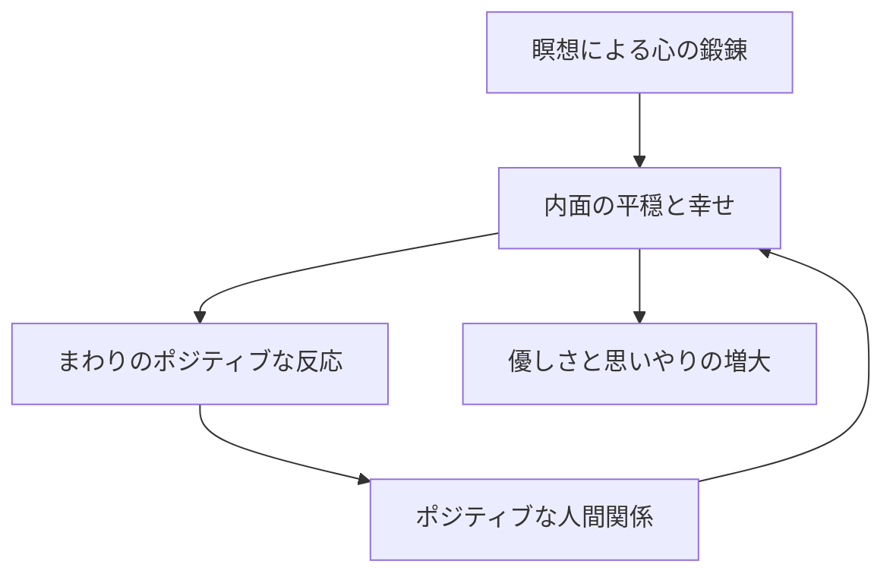

import Callout from '@/components/content/Callout.astro'
import KeyConcept from '@/components/content/KeyConcept.astro'
import Quiz from '@/components/content/Quiz.astro'
import MermaidDiagram from '@/components/content/MermaidDiagram.astro'

> 平和に至るためには平和を教えることだ．
> ――ヨハネ・パウロ二世

SIYは単純な夢として始まった．その夢とは，世界平和だ．本章は，その夢がどのようにして「サーチ・インサイド・ユアセルフ（SIY）」というカリキュラムへ結実していったのか，その裏話を語るものである．

## 世界平和は内から生み出せる

世界平和は内から生み出しうるし，また生み出されなければならないと信じている賢者は大勢いる．著者もそう信じている．誰もが自分の中で平穏と幸せを育む方法を見つけられれば，人々の内面の平穏と幸せが思いやりとなって自然に現れてくる．そして，ほとんどの人が幸せで，平和で，思いやりのある世界を生み出せるなら，世界平和の基礎を築ける．

幸い，そのための方法はすでに存在し，何千年にもわたってさまざまな人が実践してきた．それは，沈思黙考の練習を通して自分の心を育むという技だ．世間ではそれを瞑想と呼ぶ．

瞑想は一番単純に言えば，注意の練習だ．トレーニングを十分積めば，注意は揺らぐことなく穏やかで集中したものになる．そこまで注意の質を高めると，心はリラックスしていて，しかも隙のない状態になれる．そのとき，三つの素晴らしい心の特質が現れてくる．穏やかさと明瞭さと幸せだ．

<KeyConcept title="スノードームのたとえ">
心は，たえず揺さぶられているスノードームのようなものだ．無数の細片と透明な液体が入ったガラスの置物を揺するのをやめると，白い「雪」の細片はやがて沈み，液体は穏やかで透明になる．私たちの心も同じで，十分リラックスさせ，しかも隙のない状態にすれば落ち着いて穏やかになり，その中に第三の特質である内面の幸せが自然に現れる．
</KeyConcept>

内面の幸せは伝染する．誰かが内面の幸せの輝きを現し始めると，まわりはその人に前よりポジティブに反応するようになる．瞑想をする人は社会的交流がしだいにポジティブになるのに気づくだろう．私たちは社会的な生き物なので，ポジティブな人間関係がもてれば，その分，幸せになる．こうして，内面の幸せと社会的な幸せの好循環ができ上がり，瞑想をする人はますます優しく，思いやり深くなっていく．

<MermaidDiagram title="内面の幸せと社会的な幸せの好循環">

</MermaidDiagram>

私たちは心を鍛え，育み，内面の平穏を生み出せる．このトレーニングでいちばん良いのは，そうした特質をもつように自分を強制する必要がない点だ．それらはみな，すでに生まれつき私たちひとりひとりの中にあるので，それが現れ，育ち，花開くようにお膳立てをするだけでいい．十分な数の人がそうすれば，世界平和の基礎を築くことになる．

したがって，滑稽に聞こえかねないが真剣な話として，世界平和のための処方箋に欠かせない有効成分は，瞑想のような単純なことなのかもしれない．これほど手に負えない問題に，これほど単純な解決法があるとは，ほとんど不条理なほどだ．だが，現にうまくいくかもしれない．

<Callout type="note" title="著者の人生の目的">
著者は瞑想を世界にもたらそうとしているのではない．その恩恵を誰もが受けられるようにしたいと思っているだけだ．自らを「ただの扉の開け手」と呼び，宝の部屋の扉を開けて「好きなだけもっていってください．もちろん，もっていかなくてもいいのですよ」と言っているにすぎないと語る．
</Callout>

では，どうすればすべての人が瞑想の恩恵を受けられるようにできるのか．その答えが，著者がなかば冗談に「世界平和への三つの簡単なステップ」と呼ぶものだ．

1. 自分から始める
2. 瞑想を科学の一分野にする
3. 瞑想を実生活と整合させる

## 自分から始める

最初のステップはマハトマ・ガンディーに由来する．世の中で目にしたいと自分が望む変化に，自分自身がなる必要があるのだ．これに向け，著者はほぼ測定可能な目標を思いついた．誰に対してもいつも優しくできる能力を，死ぬまでに自分の中に生み出すという目標だ．著者はいわば，一日中，優しさばかりを放映している「優しさ専門のチャンネル」になりたいと言う．

## 瞑想を科学の一分野にする

瞑想を多くの人にやってもらえるようにするには，医学がそうなったように，科学の一分野にする必要がある．医療は大昔から実践されてきたが，一九世紀以降に科学の一分野となってから一変した．一番重要な変化はアクセスだったと著者は考える．科学的になったとき神秘的な要素がごっそり取り除かれ，新しい道具や設備，方法が使えるようになり，提供者の訓練と資格が大幅に改善した．つまり，前よりずっと多くの人が良い医療にアクセスできるようになったのだ．瞑想についても同じことが起こるのを著者は目にしたい．

二〇〇六年，著者は瞑想の仲間たちに，瞑想が科学になる必要性を説き，瞑想トレーニングを「データ主導」にする努力を始めてほしいと促すメールを送った．だが反応は芳しくなかった．発想は気に入ってもらえたが，誰もとくに胸を躍らせなかった．

<Callout type="tip" title="ダライ・ラマとの一致">
唯一興味を寄せてくれたのが，友人テンジン・テトンが転送した先のB・アラン・ウォレス博士だった．アランは過去六年にわたり同じ目的で研究を続けてきたと興奮して語った．理由を尋ねると，なんとダライ・ラマに頼まれたからだという．瞑想仲間の科学者たちが誰も胸を躍らせなかったのに，ダライ・ラマは違った．この瞬間，著者は自分が正しい方向に進んでいると悟った．
</Callout>

アランと著者はすぐに親友になった．関連研究を学ぶうちに著者は，ダライ・ラマの熱烈な支援があるのだから，この研究は自分がいてもいなくても進むだろうと結論した．そこで，ダライ・ラマや友人のジム・ドゥティ，ウェイン・ウーとともにスタンフォード大学の「思いやりと利他主義の研究・教育センター」（CCARE）の設立を援助するなどしたうえで，この活動は確かな人々の手に委ねられていると判断し，自分のエネルギーをステップ3に注ぐことにした．

CCARE（The Center for Compassion and Altruism Research and Education）は，スタンフォード大学医学部に所属し，個人や社会のなかに思いやりや利他主義が養われるための研究と教育を行なっている．

## 瞑想を実生活と整合させる

瞑想の恩恵に大勢の人がアクセスできるようになるためには，瞑想が一部の特別な人々だけの領域にとどまっていてはならない．瞑想は「実社会のもの」になり，どこにでもいる普通の人の生活や関心と整合させる必要がある．三つのステップのなかでこれが一番重要であり，著者が最も大きな影響を与えられるものでもある．

### 先例としての「運動」

これには先例がある．運動だ．一九二七年，ある科学者のグループがハーヴァード疲労研究所を設立し，疲労の生理学的特性の研究を始めた．その先駆的研究から運動生理学という分野が誕生し，健康な人は不健康な人とは生理的に違ってくるという発見がなされた．今日，これらの先駆者のおかげで，運動は少なくとも次の四つの重要な特徴を獲得している．

1. 誰もが「運動は自分のためになる」ことを知っている．運動をしない人でさえそれを知っている．
2. 運動をしたい人は誰でもやり方を身につけられる．情報はどこでも入手でき，トレーナーも友人にも教われる．
3. 健康で体調の良い労働者はビジネスにプラスになると企業が理解している．ジムを備えたり会費を補助する企業も多い．
4. 運動は当然のことと思われている．運動すると言って変な顔をされることはない．

<KeyConcept title="瞑想を「心のための運動」に">
著者が目指すのは，瞑想が「心のための運動」のように広く扱われ，運動と同じ四つの特徴をすべて備える世界だ．すなわち，瞑想は自分のためになると誰もが知り，誰でもやり方を身につけられ，企業はビジネスのためになると理解し，「もちろん君も瞑想すべきだよ，あたりまえだろう」と誰もが考える世界である．
</KeyConcept>

### 答えはEQ（情動的知能）にあった

どうすれば瞑想が運動のように当然と思われる世界を生み出せるのか．この問いに数か月取り組んだあと，著者は偶然，答えを見つける．それは，ダニエル・ゴールマンの『EQ こころの知能指数』を読んだときに得られた．友人ラリー・ブリリアント博士の縁でダニエル・ゴールマン（ダン）がグーグルに講演に来ることになり，著者は失礼にならないよう事前に彼の著書を読んだのだ．

そして著者は悟った．瞑想を実生活に整合させる手段こそ，EIあるいはEQとも呼ばれる情動的知能だったのだ．

EQがとても役に立つことは誰もが知っている．仕事で有能になる，昇進する，稼ぎを増やす，他人と効果的にやっていく，充実した人間関係をもつ，といった世俗的な目標を達成するのにEQが役立つことを，多くの人が知っているか，そう思っている．つまりEQは現代人の欲求や願望と完璧に整合している．

<KeyConcept title="EQの二つの重要な特徴">
EQには，世界平和とつながる二つの重要な特徴がある．第一に，成功の役に立つことを別とすれば，EQの最大の副作用は内面の幸せや共感，他人への思いやりが増すことで，これはまさに世界平和に必要なものにほかならない．第二に，EQを育む素晴らしい方法（唯一の方法かもしれない）が，「マインドフルネス瞑想」に始まる瞑想の練習である点だ．
</KeyConcept>

これだ，見つけたぞ，と著者は思った．世界平和のお膳立てをするには，マインドフルネスに基づくEQカリキュラムを創り，グーグルの中で完成させ，グーグルからの贈り物のひとつとして世界へ分け与えればいい．整合性は完璧だった．誰もがすでにEQを望み，ビジネスもEQを求めている．人々や企業がその目的を果たすのを助けながら，同時に世界平和のお膳立てができるのだ．

ダンと会ったとき，著者はほとんど自分を抑えられず，テーブルを叩かんばかりの勢いで世界平和を目指す計画を熱心に説明した．「いいですか，ダニー，私たちは世界平和の話をしているのですよ，世界平和の」．ダンは少し戸惑っていた．著者は，世界を変えるための道は，滑稽なまでに不条理な瞬間の連続であることが多いと振り返る．

## SIYカリキュラムの誕生

その後，ダンと著者は友達になり，著者はダンとラリーの人脈を通して，さらに二人の人物と知り合った．ミラバイ・ブッシュは「社会における瞑想的心のためのセンター」の所長で，思いやりにあふれる女性だった．ノーマン・フィッシャーは今日のアメリカでもとくに名の知れた禅師で，深遠な修行を日常生活に応用する達人だった．グーグル・ユニヴァーシティ（現在はグーグルEDU）の支援のもと，ミラバイ，ノーマンと著者はマインドフルネスに基づくEQ講座のカリキュラム創設に取り組み，ダンがアドバイザーとして専門知識と知恵を提供した．

カリキュラム編成チームには最終的にさらに三人が加わった．マーク・レサーはブラッシュ・ダンス出版の創立者・元CEOで実生活のビジネスの専門知識をもたらし，フィリップ・ゴールディンはスタンフォード大学の神経科学研究者として科学的な幅と深さをもたらし，イヴォンヌ・ギンズバーグはイェール大学で教える現役のセラピストとしてカリキュラムの人間的な次元を深めた．三人はそれぞれ瞑想指導者としても尊敬されていた．

講座の実施には，すべてボランティアからなる多様なチームが編成された．マッサージ・セラピストのジョエル・フィンケルスタイン，リクルーターのデイヴィッド・ラピディス，エンジニアのシュ・ホンジュン博士，学習専門家のレイチェル・ケイ，そして著者自身がメンバーだった．当時グーグル・ユニヴァーシティ責任者だったピーター・アレン博士は，このプロジェクトの守護聖人で積極的な参加者だった．

<Callout type="info" title="「世界平和」が人を動かした">
チームのメンバーは，感謝も謝礼もなく，何の見返りも保証もされていなかった．ただ，世界平和を打ち立てる機会が得られるというだけだった．それでも全員が参加を希望した．世界平和のためになら人がどれほどやってくれるかには目を見張らされる，と著者は語る．
</Callout>

講座の名前「サーチ・インサイド・ユアセルフ（己の内を探れ）」，略してSIYは，ジョエルの発案だった．彼が提案したとき，みんな笑った．著者は最初あまり気に入らなかったが，「誰もが笑うなら，それが正しいので採用する」という主義から同意した．

SIYは二〇〇七年以来グーグルで教えられ，何百もの人が恩恵を受け，人生が変わった人もいる．十分効果を発揮するようになったので，いよいよ「オープンソース」化し，グーグル以外の人にもアクセスできるようにする時が来た．本書はその活動の一環である．そして，よく言うように，結果は未来が語ってくれるだろう．

<Quiz questions={[
  {
    question: "著者が掲げた「世界平和への三つの簡単なステップ」に含まれないものはどれか？",
    options: ["自分から始める", "瞑想を科学の一分野にする", "瞑想を実生活と整合させる", "瞑想を宗教の教義として広める"],
    answer: 3,
    explanation: "三つのステップは「自分から始める」「瞑想を科学の一分野にする」「瞑想を実生活と整合させる」です．著者は瞑想を宗教化するのではなく，実社会の普通の人の生活と整合させることを目指しました．"
  },
  {
    question: "著者が瞑想を実生活に整合させる手段として見いだしたものは何か？",
    options: ["スポーツジムでの運動プログラム", "EQ（情動的知能）", "医学の臨床試験", "禅の伝統的な僧院修行"],
    answer: 1,
    explanation: "著者はダニエル・ゴールマンの『EQ こころの知能指数』を読み，現代人の欲求と完璧に整合し，かつマインドフルネス瞑想で育まれるEQこそが，瞑想を実生活へつなぐ手段だと悟りました．"
  },
  {
    question: "著者がスノードームのたとえで説明している心の特質はどれか？",
    options: ["揺さぶり続けることで明瞭になる", "リラックスして隙のない状態にすると穏やかになり内面の幸せが現れる", "外から強制することで幸せを作り出せる", "雪の細片を取り除くことではじめて透明になる"],
    answer: 1,
    explanation: "揺するのをやめたスノードームの雪が沈んで液体が透明になるように，心も十分リラックスさせ隙のない状態にすれば落ち着いて穏やかになり，内面の幸せが自然に現れる，というたとえです．"
  },
]} />
